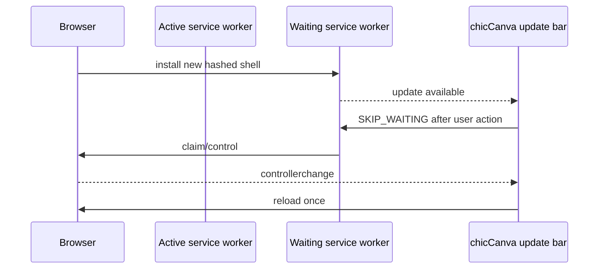

# Execution, installation, and deployment

## 1. Delivery modes

| Mode | Files | Core editor | Puter/online tools | PWA install | Offline relaunch |
|---|---|---:|---:|---:|---:|
| Direct file | `chicCanva.html` | Yes | Disabled where HTTP is required | No | File remains local |
| Windows local server | HTML + BAT | Yes | Yes, subject to network/account | Intentionally hidden | Browser cache only |
| Static HTTPS domain | PWA bundle | Yes | Yes | Yes | App shell after first load |

The editor is the same HTML in every mode. Runtime feature gates inspect protocol and hostname.

## 2. Direct-file execution

Open `chicCanva.html` directly in a modern browser. Text, canvas editing, local uploads, local PDF-to-PNG import, OpenMoji/font assets already cached or reachable, local image transforms, chroma-key removal, JSON, and image/PDF output can work. Browser security rules may restrict clipboard, remote fetch, module/model loading, and Puter.

PDF.js and its worker are embedded in the HTML. The worker is reconstructed as a temporary blob URL only when a PDF is selected, so PDF import needs no server or network connection. A deployment CSP must permit worker-src blob:.

HTTP-only widgets are disabled and show:

> Per usare la funzione apri l'app tramite webserver

Direct-file mode is useful for basic offline work, but it has a different browser storage origin from localhost and the hosted domain. Autosaves do not automatically move between these modes; use project JSON for transfer.

## 3. Windows local server

Copy these two files into the same folder:

```text
chicCanva.html
chicCanva_server.bat
```

Double-click the BAT. It opens `http://localhost:8000/` and starts a PowerShell `HttpListener`. Close the server window to stop it.

Requirements:

- Windows with built-in PowerShell and .NET;
- permission to listen on loopback port 8000;
- no Python, Node.js, npm, IIS, Apache, or installation.

If port 8000 is occupied, edit the `PORT` variable in the BAT and keep the browser URL aligned. The launcher should remain beside the HTML because it serves that file from its own directory.

The BAT also provides restricted fallbacks for public image/Openclipart retrieval. These helpers exist because third-party sites may omit CORS headers. They are not general proxies and must retain URL scheme validation, private-address rejection, allowed-target checks, content-type checks, and size limits.

## 4. Static HTTPS hosting and PWA

Publish the contents of `build/chicCanva-pwa/` at one public HTTPS path:

```text
index.html
chicCanva.webmanifest
chicCanva-sw.js
chiccanva-192.png
chiccanva-512.png
```

The HTML includes an embedded favicon plus Open Graph and Twitter Card metadata. Crawlers such as Telegram receive an absolute HTTPS `og:url`, canonical URL, and image URL in the initial HTML response without running JavaScript. The default public origin is `https://chiccanva.testthis.one/`. For another host or subpath, set `CHICCANVA_PUBLIC_URL` to the complete public HTTPS base URL before running `python development/build-workspace.py`. Keep `chiccanva-512.png` publicly reachable beside `index.html`; the generated absolute URL points to it. The service worker scope remains its containing directory.

Recommended server behavior:

| File | Content-Type | Cache guidance |
|---|---|---|
| `index.html` | `text/html; charset=utf-8` | revalidate or short cache |
| `chicCanva-sw.js` | `text/javascript; charset=utf-8` | `no-cache` or always revalidate |
| `chicCanva.webmanifest` | `application/manifest+json` | short/moderate cache |
| PNG icons | `image/png` | long immutable cache if filenames stay stable only with purge strategy |

The service worker's internal shell cache is content-versioned from the HTML SHA-256. Serving an old `chicCanva-sw.js` behind a CDN can still delay updates, so the SW response should be revalidated.

## 5. PWA eligibility and update flow

Install UI is enabled only when all of these hold:

- HTTPS;
- a non-loopback, non-IP public hostname;
- not `.local` or a private-network name/address;
- application not already running in installed/standalone display mode.

On supported Chromium browsers, the app captures `beforeinstallprompt`. On iOS/iPadOS, it provides Safari’s Share → Add to Home Screen instructions.

On update:



This avoids an indefinite splash caused by a slow network-first navigation and avoids reload loops during first installation.

## 6. Reverse proxy and CDN notes

- Preserve HTTPS through the public origin.
- Do not rewrite `chicCanva-sw.js` to HTML on 404; a service worker must return JavaScript.
- Keep the five PWA files under one scope.
- If a platform performs HTML minification or injection, the deployed HTML will differ from the locally computed hash, although the generated service worker still refers to its build cache. Prefer byte-preserving static hosting.
- Purge/revalidate the service worker during releases.
- Do not add restrictive `Cross-Origin-Embedder-Policy` or CSP rules without testing Puter, model workers, fonts, OpenMoji, Openclipart, and Blob workers.

## 7. Content Security Policy considerations

The single-file app uses inline scripts/styles, Blob workers, Data URLs, dynamic network calls, and remote resources. A strict CSP requires explicit allowances or nonces/hashes generated at deployment. Functional categories include:

- `script-src`: application inline code and `https://js.puter.com`;
- worker-src: blob: for embedded PDF.js and mobile background removal;
- `img-src`: `data:`, `blob:`, OpenMoji/Openclipart and user-selected public origins;
- `connect-src`: Puter endpoints, font providers, Openclipart, MyMemory, `staticimgly.com`, and optional arbitrary direct image URLs;
- `font-src`: Google Fonts/Fontsource CDNs and cached data;
- `style-src`: inline application styles and dynamically created font styles.

Because users can request an arbitrary public image URL, a fixed `connect-src` allowlist conflicts with that feature. Deployers wanting a strict allowlist should disable arbitrary URL import or route it through a controlled backend.

## 8. Remote dependencies by feature

| Feature | Remote dependency | Data sent |
|---|---|---|
| Font binary loading | Google Fonts / Fontsource CDN | requested family/style and ordinary request metadata |
| OpenMoji insertion | jsDelivr OpenMoji package | emoji asset path |
| Clipart search | Openclipart | English keyword, page/category |
| Keyword translation | MyMemory | user-entered phrase and language pair |
| Puter image generation | Puter and selected model provider through Puter | prompt, options, optional reference image |
| Puter-assisted image download | Puter network service | requested public URL |
| AI background removal | `staticimgly.com` for initial model/runtime files | model file requests; selected image remains local |
| PDF import | None | document bytes remain in the browser and pages are rasterized locally |

Ad blockers can block domains or injected fetch calls. The application should display a recoverable message and alternative path rather than treating extension errors as application corruption.

## 9. Offline expectations

After the PWA shell is cached, the editor can relaunch offline. Offline does not guarantee:

- an uncached font family;
- an uncached OpenMoji SVG;
- Openclipart search;
- MyMemory translation;
- Puter generation/download;
- a background-removal model never downloaded before.

Projects and embedded Data URL assets remain available through origin storage when the OS/browser retains it. Export JSON for durable backup.

## 10. Release and rollback

To release:

1. run the standard build/tests;
2. deploy all five PWA files together;
3. ensure the SW is not served from stale CDN cache;
4. load the domain in a normal tab and verify update prompt/activation;
5. launch the installed PWA and verify autosave recovery;
6. smoke-test one remote asset and one local export.

To roll back, redeploy a complete earlier five-file PWA set. Its service-worker cache ID must match its own `index.html`. Do not mix an earlier HTML with a later service worker.

## 11. Hosting checklist

- [ ] Public HTTPS URL resolves.
- [ ] All PWA files return HTTP 200 with correct MIME types.
- [ ] Manifest `start_url` and icon paths resolve within scope.
- [ ] The public page source exposes absolute chicCanva Open Graph/Twitter/canonical URLs and `chiccanva-512.png` is reachable by link-preview crawlers without authentication or bot filtering.
- [ ] Service worker is revalidated and contains no `__BUILD_ID__` placeholder.
- [ ] Install UI is hidden on localhost/file and available on the public domain where supported.
- [ ] Reload while offline reaches the editor after one successful online load.
- [ ] Autosave recovery works in both browser tab and installed PWA.
- [ ] PDF import works offline and its Blob worker is allowed by the deployed CSP.
- [ ] Remote-provider privacy/cost information is visible.
- [ ] License and attribution files are published with source distribution.
