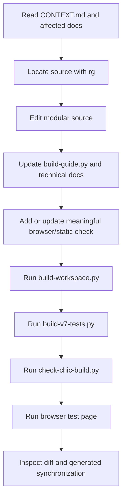

# Development workflow

## 1. Prerequisites

The shipped application has no install-time dependencies. Maintainers should have:

- Python 3 to run composition and test builders;
- Node.js if available, used only for inline JavaScript syntax validation;
- a modern Chromium/Firefox/Safari browser for manual checks;
- Windows PowerShell/.NET only when validating the BAT launcher.

There is no `npm install` step. Vendored browser libraries live under `development/` and are embedded by the build.

## 2. Sources and generated files

The most important rule is to avoid hand-editing `chicCanva.html`. It is generated and will be overwritten.

| Change | Primary source |
|---|---|
| Project/page/group/special workflow | `development/workspace.js`, `workspace-ui.html`, `workspace-special.html`, `workspace.css` |
| Toolbar/sidebar/general interaction | `development/enhancements.js`, `enhancements.css` |
| Image transforms/chroma/eyedropper | `development/image-effects.js`, `image-effects.html`, `image-effects.css` |
| Unified export/URL/clipboard/Puter additions | `development/final-upgrades.js`, `final-upgrades.css`, HTML fragments |
| Memory, image diagnostics, locks, interaction guards | `development/memory-optimizations.js`, `.css`, `memory-ui.html` |
| Touch viewport and Puter session UI | `development/runtime-upgrades.js`, `runtime-upgrades.css`, `puter-auth.html` |
| PDF import and embedded renderer | `development/pdf-import.js`, `pdf-import.html`, `pdf-import.css`, `development/vendor/pdf*` |
| App release number | `development/version.json` |
| Clipart | `development/clipart.js`, `clipart-ui.html`, `clipart.css` |
| Search translation | `development/search-translation.js` |
| Vector shapes and drawing | `development/shapes.js`, `shapes-ui.html`, `shapes.css` |
| PWA | `development/pwa.js`, `pwa-ui.html`, `pwa.css`, `development/pwa/*` |
| End-user guide | `development/build-guide.py` |
| Main composition | `development/build-workspace.py` |
| Browser regression suite | `tests/v7-tests.js` |
| Static/release checks | `tests/check-chic-build.py` |
| Technical documentation | `docs/*.md`, `CONTEXT.md`, `README.md` |

The historical baseline contains the integrated v6 implementation and vendored data. It is still the starting point for composition, but new v7 behavior should be introduced through the active modules and explicit replacements in `build-workspace.py`.

## 3. Standard change sequence



Commands from the repository root:

```powershell
python development/build-workspace.py
python tests/build-v7-tests.py
python tests/check-chic-build.py
git diff --check
```

Open the browser regression page through an HTTP server:

```text
http://127.0.0.1:8001/tests/v7-test.html?run=<new-number>
```

The query string is intentionally changed to avoid browser/service-worker cache confusion. The suite writes a visible `PASS`/`ERROR` report into the page and must end with `ALL V7 CHECKS COMPLETE`.

## 4. Build pipeline

`development/build-workspace.py` is the release command. It should:

- read the display version from `development/version.json` and inject the current build date;

1. regenerate the Italian guide;
2. regenerate the standalone documentation guide;
3. load the baseline;
4. replace the persistence section with `pending.js`;
5. inject CSS and HTML fragments;
6. apply targeted baseline markup replacements;
7. inject feature modules in their defined order;
8. embed the current guide;
9. validate every inline script with Node when available;
10. write the root HTML;
11. copy the local HTML/BAT build;
12. copy the PWA HTML/manifest/icons;
13. derive the PWA service-worker cache ID from the HTML SHA-256;
14. assert byte equality between the three HTML copies.

Every string replacement uses an assertion. If an anchor changes, update the composer deliberately instead of making the assertion permissive. Silent missed replacements create partially upgraded builds.

## 5. Adding a feature module

Prefer extending an existing coherent module. If a new module is justified:

1. create a small `.js`, `.css`, and optional `.html` fragment in `development/`;
2. add it to `build-workspace.py` at the correct dependency point;
3. avoid global names that collide with baseline functions;
4. if wrapping a function, save its current reference and call it exactly once;
5. put UI IDs in the static checker’s reachable HTML;
6. add a browser test that exercises behavior rather than only checking existence;
7. document the new module and flow.

Example wrapping pattern:

```js
const previousBindWorkspace = bindWorkspace;
bindWorkspace = function () {
  previousBindWorkspace();
  bindNewFeature();
};
```

Avoid unawaited asynchronous mutations during startup. A rejected promise in initialization can prevent the rest of the single file from binding.

## 6. Mutation and history discipline

Mutating operations should be undoable when they change project state. Use the existing history wrapper or explicit `commitHistory()` boundary. Do not record high-frequency pointer updates as separate snapshots; commit the final transformation.

A typical async mutation:

```js
async function deriveAsset() {
  const source = selectedImage();
  if (!source) return toast('Seleziona un’immagine');
  const output = await computeOutput(source);
  // Add asset/object only after output is valid.
  addDerivedObject(output);
  saveActivePage();
  scheduleAutosave();
}

deriveAsset = withHistory(deriveAsset);
```

Keep originals intact. Derived assets should record `derivedFrom`, method/model/device, source, and license when applicable.

## 7. Storage changes

Storage migrations require particular care because the workspace may contain several large projects and history snapshots.

- Preserve validation before adoption.
- Write a complete new current record before deleting the previous recovery record.
- Do not rely only on a localStorage pointer; startup scans the stable IndexedDB key.
- Keep clear-memory behavior synchronized with preferences and model caches.
- Test an absent pointer, interrupted save, large asset payload, explicit project close, and PWA standalone reopening.
- If the project JSON format changes, bump its version and update import validation. Legacy compatibility is not currently required unless explicitly reintroduced.

## 8. Network changes

Direct fetch, Puter transport, and BAT proxy are different trust/cost paths. The default must remain direct browser fetch. Puter must be an explicit checkbox/action because its network use follows the account’s user-pays quota. The BAT helper must remain restricted to public image/Openclipart targets and reject private network destinations.

Use timeouts with a named `AbortController`. Treat timeout aborts as an ordinary fallback condition. Catch them inside the feature so they do not become unhandled promise rejections.

## 9. PWA changes

The PWA `index.html` must stay byte-identical to root `chicCanva.html`. Do not add PWA-only scripts directly to `index.html`; the runtime domain gate decides whether to expose install and service-worker behavior.

When changing the service worker:

- keep the `__BUILD_ID__` placeholder in the source template;
- ensure the release build replaces it;
- avoid network-first navigation that can hang on a weak mobile connection;
- keep an explicit update activation path;
- test first install separately from update;
- test offline relaunch after the app shell has been cached.

## 10. Guide and documentation changes

The guide source is structured data in `build-guide.py`. Add or amend sections there, then build. Do not edit `development/help-v7.html` or `docs/user-guide.html` directly.

For every material feature, document:

- user purpose and steps in the Italian guide;
- internal data/process changes in `FEATURES_AND_PROCESSES.md`;
- new modules or boundaries in `TECHNICAL_ARCHITECTURE.md`;
- layout rules in `UI_UX_ARCHITECTURE.md`;
- deployment or online-service implications in `DEPLOYMENT.md` and `SECURITY_PRIVACY_LICENSING.md`;
- the condensed state in `CONTEXT.md` if a future agent must know it immediately.

## 11. Test strategy

### Static build checks

`check-chic-build.py` validates unique IDs, DOM references, font-catalog independence, launcher proxy restrictions, PWA files/cache ID, and copy equality. Add checks for release invariants that can be evaluated without browser behavior.

### Browser regression tests

`v7-tests.js` exercises workspace tabs, groups, mixed text/emoji, page insertion/reordering/deletion, autosave generations and active-project deduplication, asset collection, export-region interaction isolation, object locks, image diagnostics, export ZIP signature, clipboard ingestion, PDF parsing/rasterization, image effects, mobile settings, chroma detection, eyedropper coordinate mapping, AI options, sidebar behavior, and guide quality.

Prefer meaningful behavior tests. For example, the eyedropper regression uses a fixture whose CSS dimensions differ from its backing buffer, proving the coordinate transform rather than merely checking that a button exists.

### Manual checks

Some platform behavior cannot be fully simulated:

- browser install prompts and iOS Add to Home Screen;
- PWA kill/relaunch persistence under OS pressure;
- real Puter authentication, usage, image generation, and assisted fetch;
- actual large-model WebGPU inference;
- remote services under ad blockers and restrictive networks;
- native clipboard permissions across browsers;
- print-dialog margins and physical printer scaling.

Document manual results with browser/device/version when they matter to a release.

## 12. Release checklist

- [ ] User-visible feature and recovery path work.
- [ ] Direct-file mode still starts and local features work.
- [ ] HTTP-only widgets show “Per usare la funzione apri l’app tramite webserver”.
- [ ] Root, local, and PWA HTML copies are identical.
- [ ] BAT remains dependency-free and restricted.
- [ ] PWA build ID matches the current HTML hash.
- [ ] Guide source, standalone guide, README, docs, and CONTEXT are updated.
- [ ] Third-party notices and license implications remain accurate.
- [ ] Static checks pass.
- [ ] Browser suite ends with all checks complete.
- [ ] `git diff --check` reports no whitespace errors.
- [ ] User attachment folders and historical files were not modified accidentally.
