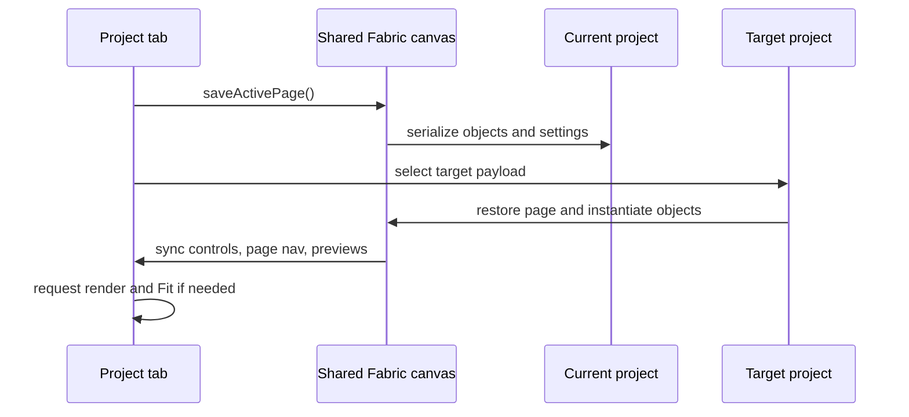
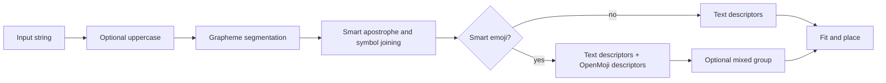
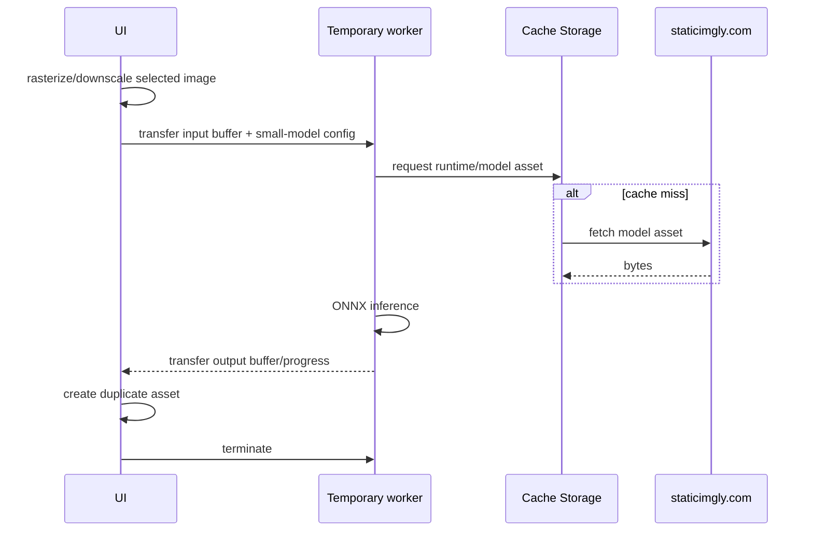

# Features and internal processes

## 1. Project and page lifecycle

chicCanva presents project tabs instead of mutually exclusive editing modes. Every project has an independent page list, object tree, asset registry, UI settings, and history. Switching tabs follows a strict save-before-load sequence:



New pages are inserted immediately after the active page and inherit its physical dimensions. A page can be renamed from the sidebar, navigator, preview, double click, or context menu. Reordering changes the array order and therefore PDF/ZIP order. Deleting a page is guarded by an application modal and is reversible while its history snapshot remains available.

The special “one letter/group per page” workflow is a macro over the custom page model. It can create a new project, append pages, or replace the current page list after confirmation. Explicit groups use `^`; automatic groups use grapheme segmentation, symbol joining, smart apostrophes, and optional OpenMoji conversion.

## 2. Text and outline rendering

Text uses Fabric text objects. Outline mode does not require a specially outlined font: it renders a normal font with transparent fill and a configurable stroke. Disabling outline uses a filled glyph. This means nearly any remotely loaded font can become colorable.

Representative object creation:

```js
const object = new fabric.Text(value, {
  fontFamily: state.fontFamily,
  fontSize: initialSize,
  fill: state.disableOutline ? state.strokeColor : 'rgba(255,255,255,0)',
  stroke: state.strokeColor,
  strokeWidth: state.disableOutline ? 0 : state.strokeWidth,
  paintFirst: 'stroke',
  objectType: 'text'
});
```

Actual property names should be checked in the current baseline before copying this excerpt; the architectural rule is `transparent fill + colored stroke` for outline and `colored fill + no outline stroke` for standard mode.

Text fitting works in document coordinates and offers three policies:

- **contain**: scale until both width and height fit inside the safety area;
- **width**: prioritize page width;
- **height**: prioritize page height.

Because Fabric text is vector-based, object scaling does not rasterize glyphs. Apparent softness can come from browser canvas interpolation at non-integer view zoom; PDF/raster export is rendered independently at the requested DPI.

### Font discovery

`font-catalog.json` contains about 2,100 metadata records. The direct picker filters name and style tags and exposes categories such as rounded, chunky/child-friendly, square, artistic, serif, sans serif, handwriting, monospace, and native outline. The wizard scores the same complete catalog from visual-profile properties, with curated profiles taking precedence over heuristics.

Font metadata is offline, while font binaries are lazy-loaded from Google Fonts or Fontsource-compatible CDN URLs. A failed request falls back to a browser font without corrupting the document. New code must keep catalog discovery separate from binary availability.

## 3. Grapheme, symbol, and emoji processing

Plain string indexing is unsafe for emoji and combined characters. chicCanva operates on grapheme clusters, preferably through `Intl.Segmenter`, so sequences containing variation selectors, skin-tone modifiers, or zero-width joiners remain intact.

The split pipeline is:



When smart emoji is enabled, text and emoji are separate children in a group. Applying a font traverses groups and changes only text descendants. Ungrouping exposes the individual OpenMoji image and text. This separation is required for changing font, emoji ink, scale, and position independently.

### OpenMoji asset construction

The full OpenMoji metadata catalog supports global search, relevant ordering, and category browsing. Italian-to-English keyword translation is opt-in and reuses the Clipart search policy: timed MyMemory lookup, compact internal didactic dictionary, then the original term. The translated query participates only in filtering and is reset whenever translation is disabled. An emoji becomes an SVG-backed image asset:

```js
emojiAssetFor = async function (grapheme, style = state.emojiStyle) {
  const hex = emojiHex(grapheme);
  const key = `openmoji:${style}:${hex}:` +
    (style === 'black' ? `${state.emojiInk}:${state.emojiStroke || 1}` : 'original');
  const found = Object.values(state.assets).find(asset => asset.sourceKey === key);
  if (found) return found.id;

  const id = await assetFromUrl(openMojiUrl(hex, style), {
    name: `OpenMoji ${grapheme}`,
    kind: 'emoji',
    source: 'OpenMoji 17.0.0',
    meta: { emoji: grapheme, hex, style, license: 'CC BY-SA 4.0' }
  });
  state.assets[id].sourceKey = key;
  return id;
};
```

Black/outline SVGs can be recolored and their stroke widths adjusted. A derived asset records style, ink, stroke, source, and license. This is a modification of OpenMoji material; preserve attribution and CC BY-SA metadata in exports and distributions.

## 4. Images and non-destructive editing

Uploaded, pasted, downloaded, generated, and derived images enter the same asset registry. Data URLs make projects portable. `originalDataUrl` retains the source for crop reset and non-destructive workflows.

### Sources

- file input;
- image item from the system clipboard;
- direct URL fetch where CORS permits;
- explicitly selected `puter.net.fetch()` path;
- local PowerShell helper when using the BAT and its allowlisted endpoint;
- Openclipart preview/download;
- Puter-generated image;
- image already selected on the canvas as an AI reference.

URL import validates scheme, response status, content type, and size before reading bytes. A web page URL is not equivalent to a direct image URL. Puter and the local helper are fallback transports, not CORS bypasses performed silently.

### PDF page import

PDF import is a local rasterization pipeline powered by the embedded PDF.js 3.11.174 display layer and worker. `File.arrayBuffer()` supplies the document bytes directly; no PDF data is sent to a server. After PDF.js reports `numPages`, the modal validates either one page number or the complete `1..numPages` sequence.

```js
const loadingTask = pdfjsLib.getDocument({ data: new Uint8Array(buffer) });
const pdf = await loadingTask.promise;
const sourcePage = await pdf.getPage(pageNumber);
const viewport = sourcePage.getViewport({ scale: 1.5 * quality });
await sourcePage.render({ canvasContext, viewport, intent: 'print' }).promise;
const png = canvas.toDataURL('image/png');
```

Quality 1×, 2×, and 3× multiplies a 1.5 base scale, corresponding approximately to 108, 216, and 324 source pixels per inch before fitting. Rendering is capped at 4096 pixels on the longest side and 20 megapixels to prevent unusual page formats from exhausting browser memory. Each temporary canvas is released after its PNG Data URL is produced.

Destination pages are always A4. Auto orientation reads the unscaled PDF viewport and chooses 210×297 mm or 297×210 mm for each page independently; fixed orientation applies the same A4 direction to every result. The image descriptor is centered and uses `min(pageWidth/imageWidth, pageHeight/imageHeight)`, which preserves aspect ratio and shows the complete source page. A new-project import creates a clean document containing only the derived assets. Append adds pages after the existing page list and opens the first imported page. Rendering completes before document state is mutated, so cancellation leaves the project unchanged.

### Crop

Crop stores a viewing rectangle relative to the original image. The editor starts the helper at the exact current crop, maps it against the full-source transform, and constrains movement and scaling to the original pixel bounds. Applying crop changes the Fabric object's crop/window properties without changing its image scale; the original asset stays untouched. Reset restores the full source without stretching. Export respects the crop and object rotation.

### Grayscale and outline

Grayscale creates a second raster. The softness control adjusts contrast/threshold behavior from line-like to tonal output. Algorithmic outline uses a Sobel-style edge detector and produces dark edges on a white background. These processes are local, deterministic, and do not consume AI credits.

## 5. Uniform-background removal

The chroma-key path is intended for line art, clipart, and generated images with a flat background. It can use a manually chosen color or automatically detect the dominant perimeter color. Automatic detection downsamples to at most 256 pixels on the longest side, samples a two-pixel perimeter, quantizes RGB into buckets, and averages the dominant bucket.

```js
const key = `${red >> 4},${green >> 4},${blue >> 4}`;
const entry = buckets.get(key) || [0, 0, 0, 0];
entry[0]++;       // number of edge samples
entry[1] += red;
entry[2] += green;
entry[3] += blue;
```

Tolerance uses the largest per-channel difference from the target. By default, all matching pixels are made transparent, including internal holes and disconnected regions. If “internal areas” is disabled, a flood fill begins at the image edges and removes only matching regions connected to the perimeter.

The eyedropper reads the already rendered lower canvas. It deliberately maps browser client coordinates to the backing-store dimensions rather than using Fabric document coordinates. This preserves correct sampling with Fit, arbitrary zoom, pan, CSS scaling, and Retina canvases.

## 6. AI background removal

The AI path embeds `@imgly/background-removal` 1.7.0 and ONNX Runtime Web JavaScript. Model files are fetched from `staticimgly.com` and retained by browser cache storage.

Desktop behavior:

- small, medium, and large models are selectable;
- CPU, WebGPU-preferred, and explicit GPU-with-CPU-fallback modes are available;
- the imported module/session remains reusable in memory to accelerate later jobs.

Mobile behavior:

- the model is forced to `isnet_quint8`;
- excessive input is downscaled to a maximum side of 1280 pixels and about 1.5 megapixels;
- inference runs in a dedicated Blob Worker;
- resource requests use Cache Storage;
- transferable buffers reduce copies;
- the worker is terminated and its URL revoked in `finally`, even on failure;
- model files may remain cached on disk, but the live model/session is released from RAM.



The operation always creates a derived copy and records the source asset, selected model, and actual device/fallback. It never intentionally uploads the source image.

## 7. Puter image generation

Puter is loaded only in HTTP(S) mode. AI controls are hidden until `puter.auth.isSignedIn()` reports an authenticated session. The explicit login button calls `puter.auth.signIn()` from its click handler; account switching calls `signIn({request_auth:true})`; logout calls `signOut()`. The user then chooses provider, model, quality, aspect ratio, style, prompt, and optional reference. Presets append prompt text; they do not replace the user's description. The chroma-key option adds an instruction requiring a completely uniform, texture-free background whose color is visually distant from the subject.

Puter-assisted URL and Clipart paths share the session state used by the AI widget. While signed out, every Puter fetch checkbox is disabled and cleared, and direct Puter insertion is disabled. A small login link closes the current URL or Clipart dialog, opens the AI section, and focuses its login button. This avoids any nested or replaced modal backdrop. After authentication, the controls become available; logout clears and disables them again.

Representative flow:

```js
const requestPrompt = userPrompt + styleInstruction +
  (aiChromaKey.checked ? AI_CHROMA_INSTRUCTION : '');

const options = {
  model: selectedModel,
  quality: selectedQuality,
  ratio: selectedAspectRatio
};

// The exact Puter overload depends on whether a reference image is present.
const generated = await puter.ai.txt2img(requestPrompt, options);
```

Reference images may come from file, URL, clipboard, or the selected canvas image. “Prepare coloring image” fills the widget with GPT Image 2, low quality, the coloring-page preset, the selected object as reference, and a tailored prompt. It never starts generation automatically.

If requested, generation is followed by a second local background-removal job. The generated original remains in the project; the removed-background version is another asset. Usage feedback calls `puter.auth.getMonthlyUsage()` only when an authenticated session exposes it. The displayed values are Puter's response for this app, not a billing guarantee.

## 8. Openclipart explorer

The explorer scrapes public Openclipart search pages because there is no embedded full catalog or required API key. Users are encouraged to search in English. Automatic translation calls MyMemory with a timeout and falls back to a compact built-in didactic dictionary; if both fail, the original keyword is preserved.

Search is asynchronous and serial-numbered. Starting a new search invalidates earlier results, preventing a slow previous request from replacing newer thumbnails. The UI disables the button, exposes `aria-busy`, shows a spinner immediately, and keeps per-thumbnail loading/failure states.

The preview modal offers:

- real device download when image bytes can be fetched;
- explicit Puter-assisted download and insertion;
- clear instructions for manual save/copy when browser restrictions prevent a programmatic download.

Openclipart artwork is external content. Its title/source URL should remain available for provenance. Do not assume search result HTML is stable; parser tests should be updated if the public markup changes.

## 9. History, autosave, and JSON

History records meaningful snapshots rather than raw pointer events. Transform operations commit at an appropriate action boundary. `withHistory()` wraps mutating async commands so a successful action becomes undoable without producing intermediate half-states.

JSON export can include or omit history. Asset collection walks the current document and optional history snapshots, then keeps only referenced assets. Import validates structure, page/object limits, history consistency, and asset shape before adoption. Imported JSON opens in a new project tab.

Autosave stores the whole open workspace, unlike a project JSON which represents one exported project. Explicitly closing a project removes it from the next workspace autosave. Clearing memory removes projects, autosave records, preferences, and cached background-removal models.

## 10. Export processes

### PDF

jsPDF creates millimetre-based pages in project order. Each Fabric page is rendered without editor-only guides, then placed into a PDF page with its matching size and orientation. The top toolbar asks whether to export the current page or the complete project.

### PNG/JPG

The unified export center chooses scope, format, DPI, quality, background, and optional region margin. PNG can preserve transparency; JPG always receives a white background. For the current page or an export region, **Copy to clipboard** renders the same output and writes it through the Async Clipboard API, so it can immediately become an AI reference or be pasted into another application. Browsers that reject JPEG clipboard items receive a PNG-compatible copy of the already rendered image. Multiple pages are collected into an uncompressed ZIP assembled directly in JavaScript with local headers, central-directory records, UTF-8 names, and CRC-32. No JSZip dependency is used.

### Export region

The export-region tool switches the sidebar to “selection in page,” defaults to transparent PNG, and lets the user draw an independent rectangle. The overlay is never serialized as page content and never appears in normal output.

## 11. Error and cancellation principles

- User-initiated network operations show busy state before their first `await`.
- An operation must restore buttons and transient canvas classes in `finally`.
- Long operations keep the original object and create a new asset only after valid output exists.
- Stale search/generation results must not replace current state.
- Browser restrictions should produce a user-facing fallback path, not console-oriented instructions.
- Destructive page/project actions use app dialogs and history where possible.


### Canvas viewport

During pinch, the viewport updates canvas CSS dimensions inside `requestAnimationFrame` without rebuilding the Fabric backing raster. On gesture completion it performs one retina-aware refresh. Manual zoom preserves the page-space center, while non-fit mode adds 75% of the viewport as navigation padding on each side so the hand tool can move the whole canvas horizontally and vertically.
