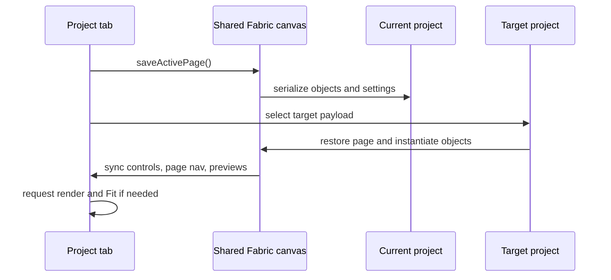
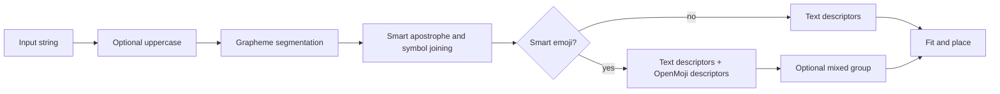
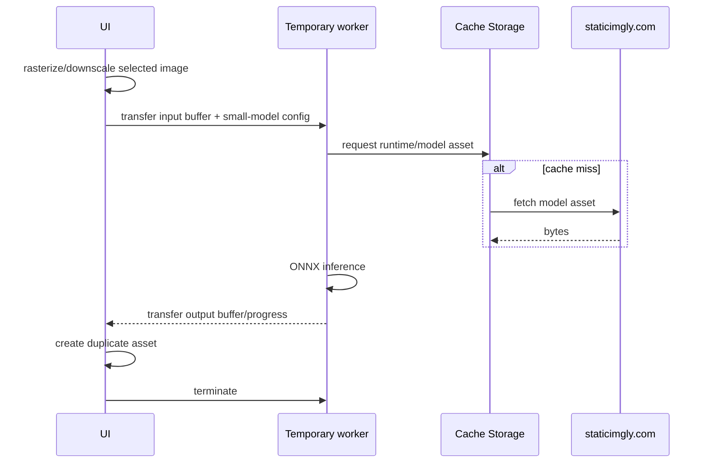

# Features and internal processes

## 1. Project and page lifecycle

chicCanva presents project tabs instead of mutually exclusive editing modes. Every project has an independent page list, object tree, asset registry, UI settings, and history. Switching tabs follows a strict save-before-load sequence:



New pages are inserted immediately after the active page and inherit its physical dimensions. A page can be renamed from the sidebar, navigator, preview, double click, or context menu. Reordering changes the array order and therefore PDF/ZIP order. Deleting a page is guarded by an application modal and is reversible while its history snapshot remains available.

The special “one letter/group per page” workflow is a macro over the custom page model. It can create a new project, append pages, or replace the current page list after confirmation. Explicit groups use `^`; automatic groups use grapheme segmentation, symbol joining, smart apostrophes, and optional OpenMoji conversion. Its `constant` banner fit first measures every group at the natural font scale, chooses the smallest page-safe scale required by the largest result, and then centers every page object with that same scale.

## 2. Text and outline rendering

Text uses Fabric text objects. Outline mode does not require a specially outlined font: it renders a normal font with transparent fill and a configurable stroke. Disabling outline uses a filled glyph. This means nearly any remotely loaded font can become colorable.

Representative object creation:

```js
const object = new fabric.Text(value, {
  fontFamily: state.fontFamily,
  fontSize: initialSize,
  fill: state.disableOutline ? state.strokeColor : 'rgba(255,255,255,0)',
  stroke: state.strokeColor,
  strokeWidth: state.disableOutline ? 0 : state.strokeWidth,
  paintFirst: 'stroke',
  objectType: 'text'
});
```

Actual property names should be checked in the current baseline before copying this excerpt; the architectural rule is `transparent fill + colored stroke` for outline and `colored fill + no outline stroke` for standard mode.

Text fitting works in document coordinates and offers three policies:

- **contain**: scale until both width and height fit inside the safety area;
- **width**: prioritize page width;
- **height**: prioritize page height.

Because Fabric text is vector-based, object scaling does not rasterize glyphs. Apparent softness can come from browser canvas interpolation at non-integer view zoom; PDF/raster export is rendered independently at the requested DPI.

### Font discovery

`font-catalog.json` contains about 2,100 metadata records. The direct picker filters name and style tags and exposes categories such as rounded, chunky/child-friendly, square, artistic, serif, sans serif, handwriting, monospace, and native outline. The wizard scores the same complete catalog from visual-profile properties, with curated profiles taking precedence over heuristics.

Font metadata is offline, while font binaries are lazy-loaded from Google Fonts or Fontsource-compatible CDN URLs. A failed request falls back to a browser font without corrupting the document. New code must keep catalog discovery separate from binary availability.

## 3. Grapheme, symbol, and emoji processing

Plain string indexing is unsafe for emoji and combined characters. chicCanva operates on grapheme clusters, preferably through `Intl.Segmenter`, so sequences containing variation selectors, skin-tone modifiers, or zero-width joiners remain intact.

The split pipeline is:



When smart emoji is enabled, text and emoji are separate children in a group. Applying a font traverses groups and changes only text descendants. Ungrouping exposes the individual OpenMoji image and text. This separation is required for changing font, emoji ink, scale, and position independently.

### OpenMoji asset construction

The full OpenMoji metadata catalog supports global search, relevant ordering, and category browsing. Italian-to-English keyword translation is enabled by default and reuses the Clipart search policy. A compact local dictionary resolves known emoji, animal, child, school, educational, shape, color, emotion, food, transport, nature, and activity terms word by word. A persistent `localStorage` cache then resolves previous successful AI translations; it is capped at 500 entries and cleared by the app memory reset. If a term remains unknown and Puter is signed in, `puter.ai.chat()` calls `google/gemma-4-31b-it` with a short icon-search translation prompt. With translation enabled, input changes do not launch calls: Enter or the magnifier explicitly commits the search, and the busy state covers translation and DOM result rendering. Without a session or after an error, the local partial translation and original unknown words remain usable. The translated query participates only in filtering and is reset whenever translation is disabled. An emoji becomes an SVG-backed image asset:

```js
emojiAssetFor = async function (grapheme, style = state.emojiStyle) {
  const hex = emojiHex(grapheme);
  const key = `openmoji:${style}:${hex}:` +
    (style === 'black' ? `${state.emojiInk}:${state.emojiStroke || 1}` : 'original');
  const found = Object.values(state.assets).find(asset => asset.sourceKey === key);
  if (found) return found.id;

  const id = await assetFromUrl(openMojiUrl(hex, style), {
    name: `OpenMoji ${grapheme}`,
    kind: 'emoji',
    source: 'OpenMoji 17.0.0',
    meta: { emoji: grapheme, hex, style, license: 'CC BY-SA 4.0' }
  });
  state.assets[id].sourceKey = key;
  return id;
};
```

Black/outline SVGs can be recolored and their stroke widths adjusted. A derived asset records style, ink, stroke, source, and license. This is a modification of OpenMoji material; preserve attribution and CC BY-SA metadata in exports and distributions.

## 4. Vector shapes and drawing

Shapes are native Fabric vector objects rather than raster assets. The forty-entry palette is paginated and filtered into Basic, School, Arrows, and Drawing tabs. Its classroom set includes book, scroll, house, sun, cloud, bookmark, tag, shield, check, cross, ribbon, puzzle, light bulb, callouts, and filled, outlined, double, and vertical block arrows. The shape descriptor records class, kind, geometric data, paint, transform, opacity, and position lock. Rectangles and ellipses retain dimension parameters; polygons and polylines retain point arrays; curves and pictograms retain path commands.

Drawing mode is isolated from ordinary object editing. The palette includes more than twenty additional educational silhouettes and renders their buttons from the same vector paths used on the canvas. Smooth freehand exposes a 1–14 interpolation control, with 6 as the default. New shapes start with a 3 px outline. On entry, chicCanva snapshots every existing object's `selectable` and `evented` flags, clears the active selection, disables target finding, and shows a crosshair. A temporary object is marked `excludeProject`, so autosave and history cannot capture a half-drawn shape. Commit assigns a project ID, restores interaction, and saves one vector object; cancel removes the temporary geometry and restores the exact prior flags.

Box-based shapes have an optional 1:1 drawing constraint. The checkbox defaults off; holding Shift XORs the stored value for the current gesture. Intrinsically square shapes such as Square and Circle preserve their defining geometry. Lines, polylines, polygons, and freehand tools are excluded from the box constraint.

Polygonal shapes expose Fabric controls bound to their point array. Point editing remains active through sidebar focus and collapse changes and ends only when the user toggles it off or selects another canvas object. Dragging an anchor maps viewport coordinates through the inverse object transform and updates one vertex. Touch controls use a larger visible anchor and a still larger hit area.

### Alignment guides and aspect constraints

Classic grid snap and magnetic guide snap are separate systems. The guide engine reads the bounding rectangle of the moving Fabric target, so a single object, a native group, and an `ActiveSelection` all follow the same path. It compares page centers and the left/center/right or top/center/bottom anchors of non-selected visible objects within an eight-screen-pixel magnetic threshold. When an object lies between neighbors, it also compares the two gaps and snaps to equal spacing. Guide lines are temporary, non-evented Fabric objects marked `excludeProject` and `excludeFromExport`; they are removed on pointer-up, modification, selection clearing, page serialization, and export.

The transform constraint records the original `scaleX` and `scaleY` in Fabric's `before:transform` event. During `object:scaling`, the active axis produces one factor that is applied to both original scales. This preserves an object's pre-existing aspect ratio without hiding side handles and applies identically to groups, multi-selection and the crop helper. Shift XORs the stored aspect-lock setting for the current resize or crop. During movement, Alt XORs guide snap. Shift+Alt explicitly suppresses guide snap and temporarily XORs classic grid snap; the stored settings are restored on pointer-up, cancellation or window blur.

Polygon and polyline construction has two modes. Click mode appends one node per click and is the desktop default. Drag-segment mode begins a segment on pointer down and commits its node only on pointer release; it is the touch default. A double activation, an explicit Finish action, or a pointer action outside the canvas terminates the trace. Raw freehand paths preserve sampled points. Smooth freehand first removes near-duplicate samples, applies a five-sample weighted moving average, simplifies the trace with Ramer-Douglas-Peucker tolerance adjusted for zoom and stroke width, and then emits cubic Bézier segments. This creates a visible stability difference without changing the raw tool.

**Duplicate as image** accepts any Fabric-renderable active object or selection, including text, OpenMoji, groups, and shapes. It renders a bounded transparent PNG, registers it as an image asset, inserts a size-matched offset copy, and retains the original. The result supports crop, image effects, serialization, and AI-reference use.

## 5. Images and non-destructive editing

Uploaded, pasted, downloaded, generated, and derived images enter the same asset registry. Data URLs make projects portable. `originalDataUrl` retains the source for crop reset and non-destructive workflows.

### Sources

- file input;
- image item from the system clipboard;
- direct URL fetch where CORS permits;
- explicitly selected `puter.net.fetch()` path;
- local PowerShell helper when using the BAT and its allowlisted endpoint;
- Openclipart preview/download;
- Puter-generated image;
- image already selected on the canvas as an AI reference.

URL import validates scheme, response status, content type, and size before reading bytes. A web page URL is not equivalent to a direct image URL. Puter and the local helper are fallback transports, not CORS bypasses performed silently.

### PDF page import

PDF import is a local rasterization pipeline powered by the embedded PDF.js 3.11.174 display layer and worker. `File.arrayBuffer()` supplies the document bytes directly; no PDF data is sent to a server. After PDF.js reports `numPages`, the modal validates either one page number or the complete `1..numPages` sequence.

```js
const loadingTask = pdfjsLib.getDocument({ data: new Uint8Array(buffer) });
const pdf = await loadingTask.promise;
const sourcePage = await pdf.getPage(pageNumber);
const viewport = sourcePage.getViewport({ scale: 1.5 * quality });
await sourcePage.render({ canvasContext, viewport, intent: 'print' }).promise;
const png = canvas.toDataURL('image/png');
```

Quality 1×, 2×, and 3× multiplies a 1.5 base scale, corresponding approximately to 108, 216, and 324 source pixels per inch before fitting. Rendering is capped at 4096 pixels on the longest side and 20 megapixels to prevent unusual page formats from exhausting browser memory. Each temporary canvas is released after its PNG Data URL is produced.

Destination pages are always A4. Auto orientation reads the unscaled PDF viewport and chooses 210×297 mm or 297×210 mm for each page independently; fixed orientation applies the same A4 direction to every result. The image descriptor is centered and uses `min(pageWidth/imageWidth, pageHeight/imageHeight)`, which preserves aspect ratio and shows the complete source page. A new-project import creates a clean document containing only the derived assets. Append adds pages after the existing page list and opens the first imported page. Rendering completes before document state is mutated, so cancellation leaves the project unchanged.

### Crop

Crop stores a viewing rectangle relative to the original image. The editor starts the helper at the exact current crop, maps it against the full-source transform, and constrains movement and scaling to the original pixel bounds. Applying crop changes the Fabric object's crop/window properties without changing its image scale; the original asset stays untouched. Reset restores the full source without stretching. Export respects the crop and object rotation.

### Grayscale and outline

Grayscale creates a second raster. The softness control adjusts contrast/threshold behavior from line-like to tonal output. Algorithmic outline uses a Sobel-style edge detector and produces dark edges on a white background. These processes are local, deterministic, and do not consume AI credits.

### Image diagnostics and pixel resampling

Selecting an image exposes its original and visible crop pixel dimensions, encoded Data URL bytes, approximate decoded RGBA memory, current size in millimetres, and effective print DPI. The values distinguish file/storage cost from runtime bitmap cost: a compressed 5 MB JPEG can decode to hundreds of megabytes.

The resolution command replaces one selected object after explicit confirmation. Factors are ¼×, ⅓×, ½×, 2×, 3×, and 4×. `createImageBitmap()` requests high-quality resampling and a temporary canvas encodes the result as PNG. Crop coordinates and source dimensions are multiplied by the factor while Fabric scale is divided by it, preserving page position and physical size. Temporary bitmap/canvas resources are closed or reduced immediately. Upscaling improves pixel count for compatibility but does not reconstruct detail.

## 6. Uniform-background removal

The chroma-key path is intended for line art, clipart, and generated images with a flat background. It can use a manually chosen color or automatically detect the dominant perimeter color. Automatic detection downsamples to at most 256 pixels on the longest side, samples a two-pixel perimeter, quantizes RGB into buckets, and averages the dominant bucket.

```js
const key = `${red >> 4},${green >> 4},${blue >> 4}`;
const entry = buckets.get(key) || [0, 0, 0, 0];
entry[0]++;       // number of edge samples
entry[1] += red;
entry[2] += green;
entry[3] += blue;
```

Tolerance uses the largest per-channel difference from the target. By default, all matching pixels are made transparent, including internal holes and disconnected regions. If “internal areas” is disabled, a flood fill begins at the image edges and removes only matching regions connected to the perimeter.

The eyedropper reads the already rendered lower canvas. It deliberately maps browser client coordinates to the backing-store dimensions rather than using Fabric document coordinates. This preserves correct sampling with Fit, arbitrary zoom, pan, CSS scaling, and Retina canvases.

## 7. AI background removal

The AI path embeds `@imgly/background-removal` 1.7.0 and ONNX Runtime Web JavaScript. Model files are fetched from `staticimgly.com` and retained by browser cache storage.

Desktop behavior:

- small, medium, and large models are selectable;
- CPU, WebGPU-preferred, and explicit GPU-with-CPU-fallback modes are available;
- every job uses a disposable Blob Worker; the selected model files remain reusable from Cache Storage, while the ONNX session and tensors are released when the worker terminates.

Mobile behavior:

- the model is forced to `isnet_quint8`;
- excessive input is downscaled to a maximum side of 1280 pixels and about 1.5 megapixels;
- inference runs in a dedicated Blob Worker;
- resource requests use Cache Storage;
- transferable buffers reduce copies;
- the worker is terminated and its URL revoked in `finally`, even on failure;
- model files may remain cached on disk, but the live model/session is released from RAM.



The operation always creates a derived copy and records the source asset, selected model, and actual device/fallback. It never intentionally uploads the source image.

## 8. Puter image generation

Puter is loaded only in HTTP(S) mode. AI controls are hidden until `puter.auth.isSignedIn()` reports an authenticated session. The explicit login button calls `puter.auth.signIn()` from its click handler; account switching calls `signIn({request_auth:true})`; logout calls `signOut()`. The visible curated catalog exposes GPT Image 2.5 Flare (the default), GPT Image 2, Grok Imagine Standard and Quality, Seedream 5 Lite, and Gemini 3.1 Flash Lite Image. OpenAI uses its documented provider adapter because exact raster controls require it. Grok, Seedream and Gemini keep their canonical, namespaced Puter IDs all the way to `txt2img()`: `x-ai/grok-imagine-image`, `byteplus/seedream-5-0-lite-260128`, and `google/gemini-3.1-flash-lite-image`. No provider override or unrelated fallback model is supplied. Juggernaut, HiDream and Qwen are hidden because live Puter requests were routed to an unavailable FLUX endpoint. Presets append prompt text; they do not replace the user's description. The chroma-key option adds an instruction requiring a completely uniform, texture-free background whose color is visually distant from the subject.

Puter-assisted URL and Clipart paths share the session state used by the AI widget. While signed out, every Puter fetch checkbox is disabled and cleared, and direct Puter insertion is disabled. A small login link closes the current URL or Clipart dialog, opens the AI section, and focuses its login button. This avoids any nested or replaced modal backdrop. After authentication, the controls become available; logout clears and disables them again.

Representative flow:

```js
const requestPrompt = userPrompt + styleInstruction +
  (aiChromaKey.checked ? AI_CHROMA_INSTRUCTION : '');

const options = {
  model: selectedModel,
  quality: selectedQuality,
  // OpenAI accepts the calculated custom dimensions through Puter's ratio.
  ratio: customResolution ? { w: calculatedWidth, h: calculatedHeight }
                          : selectedAspectRatio
};

// The exact Puter overload depends on whether a reference image is present.
const generated = await puter.ai.txt2img(requestPrompt, options);
```

Reference images may come from file, URL, clipboard, or the selected canvas image. A 0.25×, 0.5×, 0.75×, or 1× control creates a temporary high-quality PNG copy for the request; the original asset remains unchanged. “Prepare coloring image” fills the widget with GPT Image 2.5 Flare, low quality, the coloring-page preset, the selected object as reference, and a tailored prompt. It never starts generation automatically.

The estimate above the generation button uses published prices and observed Puter usage rows. It reports the dashboard's Credits scale, an indicative dollar value, approximate prompt tokens, output dimensions, and reference dimensions after scaling. For OpenAI, quality remains independent from size. The preset selector chooses an approximate minimum, 0.8K, 1K, 1.5K, or 2K short edge; the separate exact mode accepts explicit width and height and disables aspect and preset controls. `aiOpenAiDimensions()` and `aiOpenAiCustomDimensions()` enforce multiples of 16, the 1:3–3:1 aspect range, 3840 px edge maximum, and 655,360–8,294,400 pixel range. Invalid changes restore the previous valid combination and display a temporary warning. xAI exposes its distinct 1K/2K tier. Puter has no documented `txt2img()` preflight quote, so `~` is deliberate and final account usage remains authoritative.

The Prompt Library is a separate IndexedDB database. Entries contain title, tags, description, full prompt, associated style, timestamps, and an optional copy of the current reference. Search scores title matches before description and prompt matches, tag filtering is independent, and list order is newest first. When an existing entry is open, the green first action is **Use this prompt**; updating the stored entry remains a secondary action. An entry can copy its prompt text and saved reference image to the system clipboard; a separate AI-widget command reads clipboard text and appends it to the current prompt. Import/export uses a dedicated JSON envelope. The optional reference checkbox starts clear to avoid silently duplicating large Data URLs. Global memory clearing also clears this database.

If requested, generation is followed by a second local background-removal job. The generated original remains in the project; the removed-background version is another asset. Usage feedback calls `puter.auth.getMonthlyUsage()` only when an authenticated session exposes it. The displayed values are Puter's response for this app, not a billing guarantee.

Generated output recovery is provider-neutral. `aiGeneratedImageDataUrl()` first accepts Blob, canvas and data-URL results, then tries to rasterize an already decoded origin-clean image element. Remote URLs use bounded direct fetch, the local PowerShell image proxy when present, and finally `puter.net.fetch()`. If all conversion paths fail after `txt2img()` has already succeeded, chicCanva does not report the generation as lost: it retains the returned element/source for the current session and shows an inline preview. The fullscreen view exposes retry insertion, download, and open actions. A later retry reuses the same generated result and never calls the model again.

Model-routing errors remain distinct from output recovery. If Puter answers `model_not_available` after internally routing a request to another endpoint, chicCanva names the requested model and the rejected internal route. It never starts a different paid model automatically. A live smoke test on 11 September 2026 confirmed direct generation and canvas insertion for Seedream 5 Lite and Grok Imagine Standard. In the same session, canonical Juggernaut Lightning, HiDream I1 Fast, and original Qwen Image requests were redirected by Puter to an unavailable `black-forest-labs/FLUX.1-schnell` Together endpoint. Those three families are therefore excluded from the visible catalog rather than silently remapped. Gemini 3.1 Flash Lite Image was subsequently added using Puter's documented canonical ID and advertised 1K, image-editing-capable profile.

## 9. Openclipart explorer

The explorer scrapes public Openclipart search pages because there is no embedded full catalog or required API key. Users are encouraged to search in English. Automatic translation is enabled by default and uses the compact built-in dictionary first, then the persistent successful-translation cache. Fully known and cached phrases never leave the browser. Unknown text can use Gemma 4 31B through Puter when the user is already signed in; otherwise known words are translated locally and unknown words are preserved. The compact prompt is `"text" -> translate IT to EN, output only translated text, if input EN, output the same as input. If synonyms, choose the best. Context: emoji, clipart keyword search for drawing and creative projects / educational`. The preferred call uses `provider: "openrouter"`, `normalize: true`, and `reasoning: { effort: "low" }`. If the OpenRouter request fails or produces no valid final text, chicCanva retries once with the same Gemma model and `normalize: true` through Puter's default routing, omitting both provider and reasoning options. Puter's generic documentation does not list Gemma among the families covered by `reasoning_effort`, but a live browser probe on 2026-09-10 confirmed that the OpenRouter route accepts the nested reasoning option. The response parser still removes `<thought>`, `<thinking>`, `<reasoning>` and `<analysis>` blocks.

Search is asynchronous and serial-numbered. Starting a new search invalidates earlier results, preventing a slow previous request from replacing newer thumbnails. The UI disables the button, exposes `aria-busy`, shows a spinner immediately, and keeps per-thumbnail loading/failure states.

The preview modal offers:

- real device download when image bytes can be fetched;
- explicit Puter-assisted download and insertion;
- clear instructions for manual save/copy when browser restrictions prevent a programmatic download.

Openclipart artwork is external content. Its title/source URL should remain available for provenance. Do not assume search result HTML is stable; parser tests should be updated if the public markup changes.

## 10. History, autosave, and JSON

History records meaningful canvas/page snapshots rather than raw pointer events or interface configuration. Transform operations commit at an appropriate action boundary. `withHistory()` wraps mutating async commands so a successful action becomes undoable without producing intermediate half-states. Each entry keeps the page arrays and only the minimal cursor/mode metadata required to restore them. Prompt text, AI model/quality/reference settings, search/filter state, default colors and fonts with no selected object, shape/Colorizer tool parameters, grid/snap, zoom/pan, sidebar state, preview navigation, export controls and autosave preferences do not create entries. When a font, color, crop, fill or other style is applied to a selected object, the changed object descriptor is part of the page and therefore remains undoable.

JSON export can include or omit history. Asset collection walks the current document and optional history snapshots, then keeps only referenced assets. Import validates structure, page/object limits, history consistency, and asset shape before adoption. Imported JSON opens in a new project tab.

Autosave stores the whole open workspace, unlike a project JSON which represents one exported project. The root payload is the active project and its workspace entry points back to that root, so the same image Data URLs are not serialized twice. Project switching avoids deep-cloning those strings, and autosave drops its serialized string after IndexedDB commits. Explicitly closing a project forces a new revision and removes it from the stable autosave before the close operation completes. Clearing memory removes projects, autosave records, preferences, and cached background-removal models.

Only the active page is instantiated as Fabric objects. On every page change, `loadPage()` serializes or receives the page descriptor, clears the canvas, and instantiates the destination page. `memory-optimizations.js` now also walks the retired Fabric object tree after it has been detached, shrinks filter/object cache canvases to 1×1 and releases decoded `HTMLImageElement` sources. This makes inactive pages page-wise in RAM while preserving encoded asset Data URLs, page descriptors and history for immediate reopening, undo, export and the monolithic JSON format. Persistent autosaves remain in IndexedDB. Moving every encoded asset behind asynchronous per-page disk handles was rejected because it would complicate synchronous history/export and offer little benefit for decoded-bitmap pressure, which is the dominant cost while editing.

Asset garbage collection walks all current pages and retained history. It runs after history truncation, replacing a redo branch, deletion, and project close. The last independent AI reference and internal cross-project clipboard are preserved as additional roots. An image deleted from both current state and all undo entries can therefore release its Data URL instead of remaining in `state.assets` indefinitely.

## 11. Export processes

### PDF

jsPDF creates millimetre-based pages in project order. Each Fabric page is rendered without editor-only guides, then placed into a PDF page with its matching size and orientation. The top toolbar asks whether to export the current page or the complete project.

### PNG/JPG

The unified export center chooses scope, format, DPI, quality, background, and optional region margin. PNG can preserve transparency; JPG always receives a white background. For the current page or an export region, **Copy to clipboard** renders the same output and writes it through the Async Clipboard API, so it can immediately become an AI reference or be pasted into another application. Right-clicking or long-pressing the toolbar Copy icon provides the same system-image path for one object, a group, or an active multiselection while ordinary Copy keeps the editable internal representation. An unchanged PNG image uses its native asset bytes; transformed or composite content is rendered at a bounded high-resolution multiplier. Browsers that reject JPEG clipboard items receive a PNG-compatible copy. Multiple pages are collected into an uncompressed ZIP assembled directly in JavaScript with local headers, central-directory records, UTF-8 names, and CRC-32. No JSZip dependency is used.

### Export region

The export-region tool switches the sidebar to “selection in page,” defaults to transparent PNG, and lets the user draw an independent rectangle. While active it disables Fabric target finding and temporarily makes page objects non-interactive, so dragging can begin over existing content. Their previous interaction flags are restored on exit. The overlay is never serialized as page content and never appears in normal output.

## 12. Error and cancellation principles

- User-initiated network operations show busy state before their first `await`.
- An operation must restore buttons and transient canvas classes in `finally`.
- Long operations keep the original object and create a new asset only after valid output exists.
- Stale search/generation results must not replace current state.
- Browser restrictions should produce a user-facing fallback path, not console-oriented instructions.
- Destructive page/project actions use app dialogs and history where possible.

## 13. Puter account and image quote flow

The AI account panel reads `getUser()` and `getMonthlyUsage()` together, then reads `getDetailedAppUsage(puter.auth.appID)` as a separate app-scoped diagnostic. Monthly allowance, purchased top-up credits and total remaining are kept as distinct values. Reported `usage.allowanceUsed` wins over all derived arithmetic; the fallback subtracts the total remaining balance from monthly allowance plus purchased credits and returns unknown if those known buckets cannot explain the balance.

Image quotes are local. A normalized model price table is cached in local storage for 30 days and refreshed from Puter's public image-model details endpoint when missing, stale, or requested manually. Only positively recognized fields update the reviewed embedded table. Failed or non-JSON responses retain the stale cache. See [PUTER_BILLING_AND_PRICING.md](PUTER_BILLING_AND_PRICING.md) for schemas, formulas and fixtures.


### Canvas viewport

During pinch, the viewport transforms the common canvas shell inside `requestAnimationFrame` without rebuilding the Fabric backing raster. On gesture completion it removes the temporary transform, recalculates Fabric offsets and performs one retina-aware refresh. Manual zoom preserves the page-space center, while non-fit mode adds one full viewport of navigation padding on each side so the hand tool can move every canvas edge into reach horizontally and vertically.

Autosave and history snapshots are deferred while Fabric reports a live pointer transformation. Page serialization temporarily discards the active object, so running it during a long drag would otherwise detach an object, group, or multi-selection from Fabric's transform. Mouse or touch release schedules the pending snapshot immediately; no project change is lost.

# Shape palette, smoothing, and point editing

The paginated palette combines basic geometry, arrows, drawing tools, and more than twenty educational silhouettes such as pencil, ruler, notebook, blackboard, globe, flask, apple, certificate, flower, fish, butterfly and paw. Educational and arrow buttons render a compact SVG from the same normalized path used to create the Fabric object, avoiding a mismatch between a generic Unicode icon and the inserted result.

Polygon and polyline edit handles are Fabric custom controls. The action handler resolves the vertex from the active control or from `transform.corner`, converts the pointer from scene coordinates into the object's local coordinate system, replaces the point array, refreshes object dimensions and coordinates, and requests a render. The edit mode deliberately survives selection refreshes and sidebar closure until the user presses **Edit points** again. Smooth freehand first samples points by zoom-aware distance, applies Ramer–Douglas–Peucker simplification, then runs progressively stronger Chaikin passes according to the 1–14 smoothing setting. Default 6 gives a visibly smoother educational stroke while preserving intentional corners better than a fixed heavy filter.

# Colorizer workflow

Colorizer is the digital coloring workflow for printable line art and for compositions built in chicCanva. It accepts an image, text, emoji, vector shape, Fabric group, or active multi-selection. Starting the mode rasterizes the visible selection into a bounded transparent PNG and replaces the source on the page with a `colorized` image. Non-image sources use a selected 1× to 4× raster multiplier with a 4096-pixel safety cap. The default and recommended multiplier is 2×; 1× is the low-memory option. The source is retained as serialized descriptors and the immutable base raster is retained through `baseAssetId`, so restoring or recomposing does not depend on a second hidden Fabric object.

The fill tool performs a connected-region flood fill from the clicked pixel. Tolerance is Euclidean RGBA distance from the immutable source pixel. Low values work well for flat white interiors; higher values include antialiasing or scan variations. A `Uint32Array` label mask identifies regions. Paint is produced per pixel as a solid color, a two-color linear or radial gradient, or one of sixteen procedural textures: stripes, dots, checker, grid, waves, confetti, crosshatch, bricks, zigzag, diamonds, notebook, honeycomb, sprinkles, stars, scales, and weave. Linear gradient endpoints use the filled region's bounds; a radial gradient centers on the clicked point. Clicking an already labeled region replaces its style without rediscovering the contour.

The brush samples the source color under the start of the stroke. With smart edges enabled it paints only pixels within the configured tolerance and rejects strong dark outline pixels. Interpolated hard circular stamps create a continuous opaque stroke without cumulative alpha seams. Every pointer gesture owns one label and creates one history entry. Adjacent labels with the same style merge, so a brush closure and a later fill become one removable region.

Every fill and completed brush stroke creates a new visible asset, a lossless PNG-encoded label mask and one history boundary. `asset.meta.colorizer.operations` stores compact operation summaries, capped at 200 entries. The optimized brush batches pointer movement once per display frame, but retains every queued segment and the established interpolation spacing. Reusable typed membership maps replace large per-pixel JavaScript sets. A separate pointer-transparent canvas previews the currently edited object above Fabric using the current viewport and retina transforms, so smart-edge rejection is visible during the gesture without forcing a full Fabric redraw. The Colorizer work surface remains the Fabric object's live element for the whole editing session; committing a stroke updates the serialized PNG and metadata without replacing that surface. This detail is required for the second and later strokes to remain visible during movement. Pointer-up drains the final sample, writes to the canonical label map and performs the complete composition once. The fill algorithm is unchanged and consumes that same canonical map, preserving brush-to-fill and fill-to-brush merging. A connected-component mask computed at smart-brush start prevents a stroke from jumping across a contour, while a brush with edge protection disabled can deliberately bridge regions. Fill expansion advances through a bounded number of adjacent antialias pixels, marks a strong dark contour as terminal, and never propagates from that terminal pixel. Composition paints behind partial alpha and restores opaque contour pixels above the paint. This reaches the visible edge without opening a path through the outline. Equal styles merge only through touched or adjacent labels, so isolated compartments remain separate. Secondary click or mobile long press opens the erase-region command. The Fabric descriptor carries a compact `colorizerBackup` metadata copy, and garbage collection skips busy commits and retains session/pending IDs. Undo/redo can therefore repair metadata and re-enter Colorizer when the restored snapshot contains the active Colorizer object. Ending the mode removes the live overlay, converts the live surface back to the committed image asset, clears reusable masks, the temporary 2D context, decoded base image, `ImageData`, label array, pending animation frame and cursor, shrinks its canvas to 1×1, and restores ordinary Fabric selection. The legacy sampling/preview path can be selected with `?colorizerBrush=legacy` for diagnosis without changing saved projects.

`Ripristina oggetto originale` removes the colorized image and instantiates the stored source descriptors. Translation, scale, and rotation accumulated on the raster object are applied to the restored source. A crop made on a rasterized non-image is intentionally not mapped back to vector geometry. Clipboard commands export either the visible colorized PNG or a freshly rendered transparent PNG of the source descriptors.

Groups are supported without keeping decoded duplicate bitmaps. An active selection is normalized into a source group before rasterization. The ordinary context-menu command `Duplica come immagine` remains available when a permanent raster copy is wanted without entering the coloring mode.

## Clipboard priority and direct text editing

`copySelectionMultipurpose()` is shared by the toolbar, object context menu, and Ctrl/Cmd+C. It records serialized objects and referenced assets in the internal clipboard, then attempts to expose a PNG of that exact selection to external applications. An external clipboard-permission failure never invalidates the structured copy. Standard paste prioritizes the internal payload and reads an OS clipboard image only if no compatible chicCanva copy exists. Dedicated image-paste buttons remain explicit raster imports.

When one plain text object is selected, the Text widget exposes a direct-edit session. It records the top-left anchor and rendered dimensions, then updates the text or rebuilds a mixed Smart Emoji group. Natural size, fixed width, fixed height, and fixed bounding-box modes support optional uniform scaling. Every mode restores the original top-left point with `setPositionByOrigin()` and creates one undoable canvas change.

## Transform cancellation and resize snapping

The alignment subsystem records the initial pose and point opposite the active Fabric control in `before:transform`. Aspect-constrained scaling restores that point after changing the two scales, including side-handle operations. During `object:scaling`, classic grid snap and magnetic guide snap target the dragged edge against the grid, page centre, and neighbouring object edges or centres. The crop helper uses the same path and synchronizes its non-destructive preview. Escape restores the captured pose and aborts Fabric's active transform; crop and shape sessions have explicit cancellation fallbacks.
