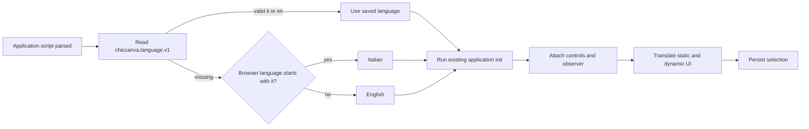

# Localization architecture

chicCanva 1.12 introduces an embedded two-language interface. Italian is the editorial source used while features are designed; English is maintained as an equally complete runtime language. Project content, page names, prompts written by the user, imported filenames, font names, and search results are never translated automatically.

## Runtime flow



`development/i18n.js` loads after every feature module and wraps the existing `init()` function. It selects the language before invoking the wrapped initializer, then translates the DOM, observes later status/dialog changes, synchronizes desktop and mobile selectors, and emits `chiccanva:languagechange`.

```js
t('Pagina corrente'); // "Current page" when English is active
appLocale();          // "it-IT" or "en-GB"
applyLanguage('en');  // UI, guide, manifest, and persisted preference
```

The exact catalogue is in `I18N_EN`. Narrow patterns cover values such as page counts, credits, timestamps, and generated labels. Original and translated text are tracked in `WeakMap` instances so an `en → it` switch restores the source. Editable and user-owned regions are excluded.

## Selection and persistence

`development/i18n-ui.html` supplies the desktop selector immediately before **Guide**. `development/i18n-mobile-ui.html` supplies the labelled selector before mobile memory controls. CSS-rendered embedded SVG flags are used because Windows often renders Unicode flags as `IT` and `GB` letters.

The setting uses `chiccanva.language.v1`. With no saved value, browser locales beginning with `it` select Italian; every other locale selects English. Global memory reset removes the preference, so the next load detects the browser again.

## User guides

- `development/build-guide.py` generates the Italian `help-v7.html`.
- `development/build-guide-en.py` generates the English `help-v7-en.html`.

Both contain 58 feature sections, 18 workflows, 23 FAQs, a table of contents, and shortcuts. The build embeds both and mounts the active fragment. `build-docs.py` publishes the same content as `docs/user-guide.html` and `docs/user-guide-en.html`. Update both generators whenever a feature changes; never hand-edit generated guide HTML.

## AI prompt localization

The user prompt stays unchanged. The application then appends the selected style preset in the active UI language, any active chroma-key instruction in that language, and a final instruction requiring visible generated text to use the language of the user prompt unless the user explicitly asks otherwise. Italian presets live in `AI_STYLES_IT`; the original `AI_STYLES` catalogue supplies English. **Show full prompt sent** displays the exact composition.

Search translation is separate: Emoji/Openclipart may convert Italian keywords to English through the compact dictionary and optional Puter/Gemma fallback. It does not change project content.

## Build behavior

The desktop/server artifact remains one HTML file with both catalogues and guides. The PWA externalizes its generated application script for caching and ships `chicCanva.webmanifest` plus `chicCanva-en.webmanifest`; changing language updates the active manifest. File mode keeps the same offline editor behavior.

## Maintenance workflow

1. Design and review the Italian source text.
2. Add its English equivalent to `I18N_EN`.
3. Use a narrow pattern or `t()` for dynamic text.
4. Keep user-controlled elements in `I18N_SKIP_SELECTOR`.
5. Update both guide generators and relevant technical docs.
6. Rebuild and test `it → en → it`.

Do not use visible text as an internal identifier. Use IDs, option values, `data-*` attributes, or stable object keys so translation cannot change behavior.

## Validation checklist

- First load follows browser language; later loads use the saved setting.
- Both selectors show the same language and real flags.
- `html[lang]`, title, controls, tooltips, placeholders, dialogs, statuses, credits, and guide change together.
- Switching back restores Italian source text.
- Canvas objects, names, prompts, filenames, and imported data remain unchanged.
- AI style, chroma, and text-language instructions follow the active UI language.
- Both standalone guides regenerate with matching structural coverage.
- Monolithic syntax, PWA inventory/cache ID, and editor regression tests pass.
