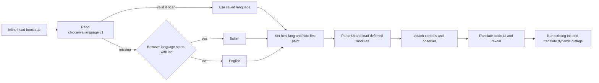

# Localization architecture

chicCanva 1.12 introduces an embedded two-language interface. Italian is the editorial source used while features are designed; English is maintained as an equally complete runtime language. Project content, page names, prompts written by the user, imported filenames, font names, and search results are never translated automatically.

## Runtime flow



An inline bootstrap in the document head selects `html[lang]` before the body can paint. `development/i18n.js` loads after every feature module, attaches the mutation observer, translates and reveals the static DOM, and only then invokes the wrapped `init()` function. Restore dialogs and every other dynamic node are therefore translated as they are inserted. A six-second emergency reveal prevents a missing/corrupt PWA script from leaving the document permanently invisible.

```js
t('Pagina corrente'); // "Current page" when English is active
appLocale();          // "it-IT" or "en-GB"
applyLanguage('en');  // UI, guide, manifest, and persisted preference

setLocalizedText(status, 'Operazione completata');
setLocalizedTextParts(counter, 'Pagina', ' ', pageNumber);
setLocalizedAttribute(button, 'data-tip', 'Incolla oggetti · Ctrl+V');
```

The exact catalogue is in `I18N_EN`. Narrow patterns cover values such as page counts, credits, timestamps, and generated labels. `setLocalizedText()`, `setLocalizedTextParts()`, and `setLocalizedAttribute()` bind rerendered content to its canonical Italian source instead of treating the currently displayed language as the source. Original and translated text are tracked in `WeakMap` instances so an `en → it` switch restores the source. Editable and user-owned regions are excluded.

## Selection and persistence

`development/i18n-ui.html` supplies the desktop selector immediately before **Guide**. `development/i18n-mobile-ui.html` supplies the labelled selector before mobile memory controls. CSS-rendered embedded SVG flags are used because Windows often renders Unicode flags as `IT` and `GB` letters.

The setting uses `chiccanva.language.v1`. With no saved value, the head bootstrap checks `navigator.languages`, `navigator.language`, the legacy browser language and the locale reported by `Intl.DateTimeFormat`; an Italian entry selects Italian and every other result selects English. Storage access is isolated from detection, so a mobile browser that temporarily blocks `localStorage` cannot force the English fallback. Global memory reset removes the preference, so the next load detects the browser again.

Names generated by the application follow the active language: `Project 2`, `Page 3`, `Untitled page`, duplicate suffixes, recovered projects and special-workflow projects are produced by localization helpers. User-entered, imported and previously saved names are preserved verbatim when the interface language changes.

## User guides

- `development/build-guide.py` generates the Italian `help-v7.html`.
- `development/build-guide-en.py` generates the English `help-v7-en.html`.

Both contain the same complete set of feature sections, workflows, FAQs, a table of contents, and shortcuts. The build embeds both and mounts the active fragment. `build-docs.py` publishes the same content as `docs/user-guide.html` and `docs/user-guide-en.html`. Update both generators whenever a feature changes; never hand-edit generated guide HTML.

## AI prompt localization

The user prompt stays unchanged. The application appends the selected style preset in the active UI language and any active chroma-key instruction in that language. It does not inject a language instruction for visible text. When generated text is required, the user should state the exact wording and language in the prompt; reusable wording can be stored in Prompt Library. Italian presets live in `AI_STYLES_IT`; the original `AI_STYLES` catalogue supplies English. **Show full prompt sent** displays the exact composition.

Search translation is separate: Emoji/Openclipart may convert Italian keywords to English through the compact dictionary and optional Puter/Gemma fallback. Parenthesized text supplies meaning context to Gemma but is removed from the actual search term and from local fallback output. Only the searchable phrase forms the translation-cache key, so `suora (quella dei preti)` stores the reusable mapping `suora → nun`. A small **Delete saved translations** link appears under both Italian search controls and clears only this shared cache. In English UI the checkbox, Puter hint, and cache command are hidden and disabled; returning to Italian restores the saved preference.

## Build behavior

The desktop/server artifact remains one HTML file with both catalogues and guides. The PWA externalizes its generated application script for caching and ships `chicCanva.webmanifest` plus `chicCanva-en.webmanifest`; changing language updates the active manifest. The head bootstrap remains inline and every local PWA asset URL carries the current build ID, preventing a newly uploaded index from executing an older cached runtime. File mode keeps the same offline editor behavior.

## Maintenance workflow

1. Design and review the Italian source text.
2. Add its English equivalent to `I18N_EN`.
3. Use the element helpers for rerendered content and attributes; use a narrow pattern or `t()` for composed values.
4. Keep user-controlled elements in `I18N_SKIP_SELECTOR`.
5. Update both guide generators and relevant technical docs.
6. Rebuild and test `it → en → it`.

Do not use visible text as an internal identifier. Use IDs, option values, `data-*` attributes, or stable object keys so translation cannot change behavior.

Do not hardcode a feature-level language conditional for visible UI. Dynamic controls must retain the canonical source and pass through the same catalog as static controls. Language-specific AI prompt material is the intentional exception described above because it is request content rather than an interface identifier.

## Validation checklist

- First load follows the complete browser locale list before first paint; later loads use the saved setting.
- Newly generated project/page names follow the active UI language without renaming existing content.
- Both selectors show the same language and real flags.
- `html[lang]`, title, controls, tooltips, placeholders, dialogs, statuses, credits, and guide change together.
- Switching back restores Italian source text.
- Canvas objects, names, prompts, filenames, and imported data remain unchanged.
- AI style and chroma instructions follow the active UI language; no automatic visible-text language instruction is added.
- Both standalone guides regenerate with matching structural coverage.
- Monolithic syntax, PWA inventory/cache ID, and editor regression tests pass.
