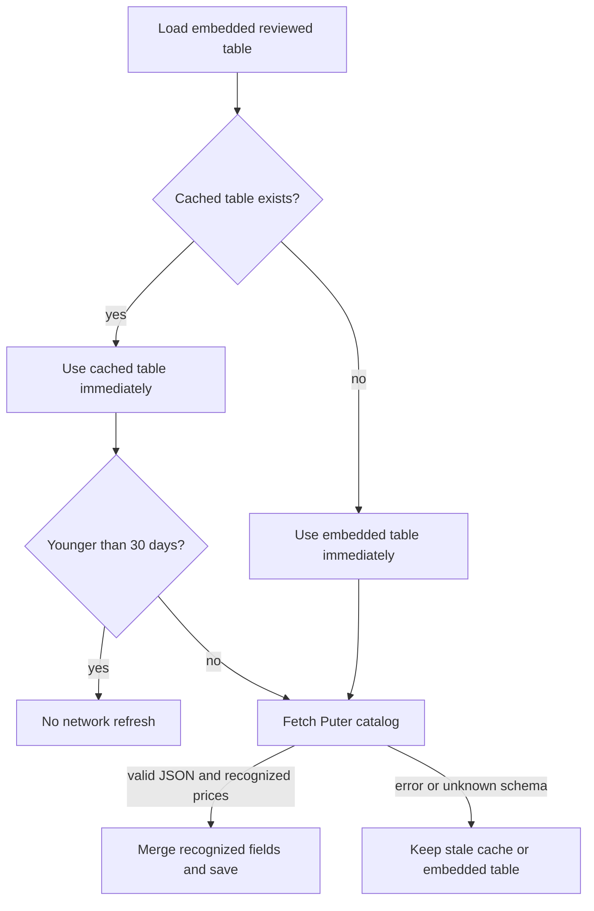

# Puter billing and image pricing in chicCanva

This document records the production findings and implementation rules used by chicCanva for Puter account balances and image-generation estimates. It is intended both for maintainers and for an AI agent resuming work on the project.

## Source hierarchy

The application trusts data in this order:

1. the current signed-in user's Puter payload;
2. Puter's public documentation and model-details catalog;
3. a previously validated local pricing cache;
4. the reviewed pricing table embedded in `development/puter-billing.js`.

The account balance and the image quote are separate systems. The balance is read from Puter. The quote is computed locally and never blocks editing or generation.

## Account snapshot

The account widget uses these SDK calls:

```js
const [user, monthly] = await Promise.all([
  puter.auth.getUser(),
  puter.auth.getMonthlyUsage()
]);

const appUsage = await puter.auth.getDetailedAppUsage(puter.auth.appID);
```

`user.subscribed` determines whether the account is a subscription or a free/non-subscription account. A large balance does not imply a subscription because purchased top-ups can coexist with the monthly allowance.

The fields currently used are:

| Meaning | Puter field | Treatment |
| --- | --- | --- |
| Account type | `user.subscribed` | Reported |
| Monthly allowance | `allowanceInfo.monthUsageAllowance` | Reported live; never hardcoded as an account fact |
| Purchased credits | `allowanceInfo.addons.purchasedCredits` | Reported when present, otherwise zero |
| Total remaining | `allowanceInfo.remaining` | Authoritative reported balance |
| Used | `usage.allowanceUsed` | Preferred reported value |
| Used fallback | `usage.total` | Observed aggregate fallback |
| App-specific use | `getDetailedAppUsage(...).total` | Separate app-scoped diagnostic |

The fallback arithmetic includes both known capacity buckets:

```js
knownCapacity = monthUsageAllowance + purchasedCredits;
used = knownCapacity - remaining;
```

If `remaining` exceeds the known capacity, chicCanva shows the used amount as unavailable. It never displays a negative consumption value or guesses the value of an unknown add-on.

### Units and USD

Production payloads have been observed with `allowanceInfo.unit === "credits"`, even though older API documentation described microcents. Conversion always inspects the returned unit.

```text
credits       -> USD = amount / 2,000
microcents    -> USD = amount / 100,000,000
usd-cents     -> USD = amount / 100
USD           -> unchanged
```

The observed current conversion is 2,000 Puter credits per US dollar. It is stored as configuration rather than spread through the UI. Balance credits show whole credits and USD with two decimals. Preflight estimates show whole credits and USD with three decimals.

The detailed usage object's resource `units` must not be summed as tokens. Depending on the meter, they can represent text tokens, image tokens, images, megapixels, bytes, operations, or provider-specific units.

## Pricing catalog and cache

The preferred public catalog is:

```text
https://api.puter.com/puterai/image/models/details
```

The similarly named `puter.com` route has returned an HTML application shell and is therefore rejected. chicCanva accepts the response only when it is JSON and contains a recognized positive price for at least one visible model.

The normalized cache is written to local storage under:

```text
chiccanva.puter-image-pricing.v1
```

It has a 30-day TTL. Startup behavior is:



The **Aggiorna prezziario** link forces the same validation path. An invalid response never overwrites a working cached table with zeroes. **Cancella memoria** removes the pricing cache along with the other persistent app data.

## Supported price strategies

Only models visible in chicCanva are normalized:

| Model | Strategy | Live fields used |
| --- | --- | --- |
| GPT Image 2 / 2.5 Flare | text, image-input and image-output token rates | `text_input`, `image_input`, `image_output` |
| Grok Imagine Standard / Quality | fixed output tier plus media input | `output:1k`, `output:2k`, `media_input` |
| Seedream 5 Lite | fixed per image | `per-image` |
| Gemini 3.1 Flash Lite Image | text/image token rates and 1K headline | `input`, `output`, `output_image`, `1K:1x1` |

Catalog values currently arrive in `usd-cents`; normalization divides them by 100. Unknown keys are ignored. Formula code remains separate from the commercial coefficients so a catalog update cannot silently change how a meter is interpreted.

## Local estimate

Each change to model, quality, output dimensions, prompt, or reference image recomputes a local quote. No billing API call occurs on each keystroke.

The quote includes:

- output cost for model, quality and dimensions;
- estimated prompt input tokens;
- an estimated reference-image component after the selected downscale factor;
- whole Puter credits and USD to three decimals;
- a confidence label.

OpenAI output dimensions and quality are independent controls. The app validates the selected width and height before quoting or generating. Tokenized image output is estimated from the calibrated output-token curve and multiplied by the current output-token rate. Reference inputs are approximate because provider preprocessing is not known before the request.

Grok uses fixed prices for its 1K/2K tiers. Seedream uses the per-image catalog price and a conservative reference fallback where Puter does not expose a separate editing-input rate. Gemini uses its image-output token rate and estimates input image tiles. These are preflight estimates; the authoritative charge remains Puter's post-generation metering.

## Refresh behavior

The account widget refreshes when the user presses **Aggiorna** and shortly after a generation completes. The delay lets Puter finish recording the request. Pricing refresh has its own manual link and 30-day schedule; it is not coupled to every generation.

## Defensive and privacy rules

- Never expose or export `puter.auth.authToken`.
- Do not log user email, UUID, session data, or private URLs.
- Treat app-specific usage and total account balance as different scopes.
- Preserve unknown values as unavailable instead of coercing them to zero.
- Reject non-JSON catalog responses.
- Keep a usable stale price table after network errors.
- Keep estimation local and generation behind an explicit user click.

## Regression fixtures

The key top-up fixture is:

```json
{
  "usage": { "allowanceUsed": 911.100411 },
  "allowanceInfo": {
    "monthUsageAllowance": 1000,
    "addons": { "purchasedCredits": 20000 },
    "remaining": 20088.899589,
    "unit": "credits"
  }
}
```

Expected output: 911 used, 20,089 available, $0.46 used, $10.04 available, 1,000 monthly allowance, and 20,000 top-up credits. The old expression `monthUsageAllowance - remaining` would produce an invalid negative result and must never return.

## Relevant implementation files

- `development/puter-billing.js` — snapshot, unit conversion, catalog adapter, cache and estimates.
- `development/puter-usage.html` — account summary UI.
- `development/ai-generation.js` — model profiles, dimensions and generation request.
- `development/ai-generation.css` — responsive account, estimate and reference controls.
- `development/build-workspace.py` — embeds the module in monolithic builds and splits the PWA build.

