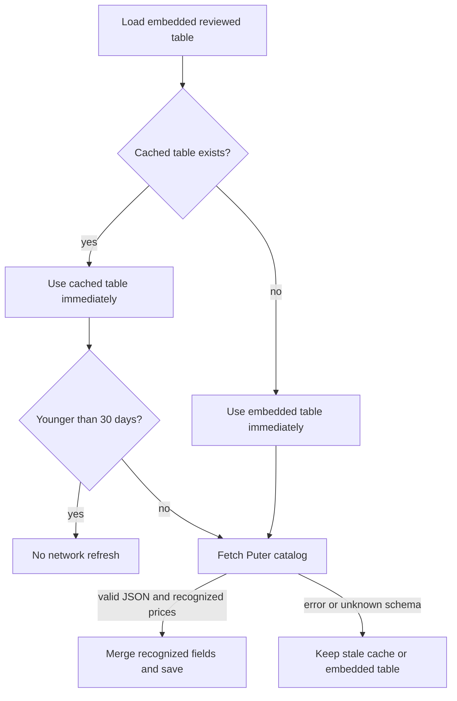

# Puter billing and image pricing in chicCanva

This document records the production findings and implementation rules used by chicCanva for Puter account balances and image-generation estimates. It is intended both for maintainers and for an AI agent resuming work on the project.

## Source hierarchy

The application trusts data in this order:

1. the current signed-in user's Puter payload;
2. Puter's public documentation and model-details catalog;
3. a previously validated local pricing cache;
4. the reviewed pricing table embedded in `development/puter-billing.js`.

The account balance and the image quote are separate systems. The balance is read from Puter. The quote is computed locally and never blocks editing or generation.

## Account snapshot

The account widget uses these SDK calls:

```js
const [user, monthly] = await Promise.all([
  puter.auth.getUser(),
  puter.auth.getMonthlyUsage()
]);

const appUsage = await puter.auth.getDetailedAppUsage(puter.auth.appID);
```

`user.subscribed` determines whether the account is a subscription or a free/non-subscription account. A large balance does not imply a subscription because purchased top-ups can coexist with the monthly allowance.

The fields currently used are:

| Meaning | Puter field | Treatment |
| --- | --- | --- |
| Account type | `user.subscribed` | Reported |
| Monthly allowance | `allowanceInfo.monthUsageAllowance` | Reported live; never hardcoded as an account fact |
| Purchased credits | `allowanceInfo.addons.purchasedCredits` | Reported when present, otherwise zero |
| Monthly use | `usage.allowanceUsed` | Credits consumed from the current monthly allowance |
| Purchased-credit use | `allowanceInfo.addons.consumedPurchaseCredits` | Credits consumed after the allowance was exhausted |
| Reported remaining | `allowanceInfo.remaining` | Retained for diagnostics; older/current payloads may expose only one bucket here |
| Used fallback | `usage.total` | Observed aggregate fallback |
| App-specific use | `getDetailedAppUsage(...).total` | Separate app-scoped diagnostic |

Puter spends the monthly allowance first and purchased credits second. The primary totals therefore use the two reported components rather than capping usage at the monthly allowance:

```js
monthlyRemaining = max(0, monthUsageAllowance - allowanceUsed);
purchasedRemaining = max(0, purchasedCredits - consumedPurchaseCredits);
globalRemaining = monthlyRemaining + purchasedRemaining;
globalUsed = allowanceUsed + consumedPurchaseCredits;
```

The progress bar is `globalRemaining / (monthUsageAllowance + purchasedCredits)`. This makes a fully spent free allowance and a nearly untouched top-up appear as a mostly available account rather than as an exhausted one. Both rows show total, used and residual values. If one of the component fields is unavailable, chicCanva keeps it unavailable and uses only a safe reported fallback; it never derives a negative balance.

### Units and USD

Production payloads have been observed with `allowanceInfo.unit === "credits"`, even though older API documentation described microcents. Conversion always inspects the returned unit.

```text
credits       -> USD = amount / 2,000
microcents    -> USD = amount / 100,000,000
usd-cents     -> USD = amount / 100
USD           -> unchanged
```

The observed current conversion is 2,000 Puter credits per US dollar. It is stored as configuration rather than spread through the UI. Balance credits show whole credits and USD with two decimals. Preflight estimates show whole credits and USD with three decimals.

The detailed usage object's resource `units` must not be summed as tokens. Depending on the meter, they can represent text tokens, image tokens, images, megapixels, bytes, operations, or provider-specific units.

## Pricing catalog and cache

The preferred public catalog is:

```text
https://api.puter.com/puterai/image/models/details
```

The similarly named `puter.com` route has returned an HTML application shell and is therefore rejected. chicCanva accepts the response only when it is JSON and contains a recognized positive price for at least one visible model.

The normalized cache is written to local storage under:

```text
chiccanva.puter-image-pricing.v1
```

It has a 30-day TTL. Startup behavior is:



The **Aggiorna prezziario** link forces the same validation path. An invalid response never overwrites a working cached table with zeroes. **Cancella memoria** removes the pricing cache along with the other persistent app data.

## Supported price strategies

Only models visible in chicCanva are normalized:

| Model | Strategy | Live fields used |
| --- | --- | --- |
| GPT Image 2 / 2.5 Flare | text, image-input and image-output token rates | `text_input`, `image_input`, `image_output` |
| Grok Imagine Standard / Quality | fixed output tier plus media input | `output:1k`, `output:2k`, `media_input` |
| Seedream 5 Lite | fixed per image | `per-image` |
| Gemini 3.1 Flash Lite Image | text/image token rates and 1K headline | `input`, `output`, `output_image`, `1K:1x1` |

Catalog values currently arrive in `usd-cents`; normalization divides them by 100. Unknown keys are ignored. Formula code remains separate from the commercial coefficients so a catalog update cannot silently change how a meter is interpreted.

## Local estimate

Each change to model, quality, output dimensions, prompt, or reference image recomputes a local quote. No billing API call occurs on each keystroke.

The quote includes:

- output cost for model, quality and dimensions;
- estimated prompt input tokens;
- an estimated reference-image component after the selected downscale factor;
- whole Puter credits and USD to three decimals;
- a confidence label.

OpenAI output dimensions and quality are independent controls. The app validates the selected width and height before quoting or generating. Tokenized image output is estimated from a monotonic curve over total output pixel area and multiplied by the current output-token rate. Earlier code scaled from a different minimum short edge for every aspect ratio; at the same “2K short edge” that could make a larger portrait output look cheaper than a smaller square. The estimate now always rises with pixel area. This is still an approximation: provider image tokens are bucketed and dashboard rows may aggregate requests, so two nearby dimensions do not necessarily receive a perfectly proportional real charge. Reference inputs remain approximate because provider preprocessing is not known before the request.

Grok uses fixed prices for its 1K/2K tiers. Puter's `txt2img()` adapter documents those quality tiers but does not document an aspect-ratio argument for Grok, so chicCanva keeps its ratio selector fixed rather than claiming a control that may be ignored. Seedream uses the per-image catalog price and a conservative reference fallback where Puter does not expose a separate editing-input rate. Gemini 3.1 Flash Lite Image is sent through its canonical Puter model ID with a `ratio` object; its supported ratios are `1:1`, `2:3`, `3:2`, `3:4`, `4:3`, `4:5`, `5:4`, `9:16`, `16:9`, and `21:9`. This model exposes only 1K output and no separate quality tier. These are preflight estimates; the authoritative charge remains Puter's post-generation metering.

## Refresh behavior

The account widget refreshes when the user presses **Aggiorna** and shortly after a generation completes. The delay lets Puter finish recording the request. Pricing refresh has its own manual link and 30-day schedule; it is not coupled to every generation.

## Defensive and privacy rules

- Never expose or export `puter.auth.authToken`.
- Do not log user email, UUID, session data, or private URLs.
- Treat app-specific usage and total account balance as different scopes.
- Preserve unknown values as unavailable instead of coercing them to zero.
- Reject non-JSON catalog responses.
- Keep a usable stale price table after network errors.
- Keep estimation local and generation behind an explicit user click.

## Regression fixtures

The key top-up fixture is:

```json
{
  "usage": { "allowanceUsed": 1000 },
  "allowanceInfo": {
    "monthUsageAllowance": 1000,
    "addons": {
      "purchasedCredits": 20000,
      "consumedPurchaseCredits": 90.34114001228214
    },
    "unit": "credits"
  }
}
```

Expected output: 1,090 used globally, 19,910 available globally, zero monthly allowance remaining, and approximately 19,910 purchased credits remaining. The UI also states the allowance-first/top-up-second order. Reading `allowanceUsed` alone would incorrectly cap total use at 1,000; using an ambiguous `remaining` field alone can incorrectly hide purchased credit.

## Relevant implementation files

- `development/puter-billing.js` — snapshot, unit conversion, catalog adapter, cache and estimates.
- `development/puter-usage.html` — account summary UI.
- `development/ai-generation.js` — model profiles, dimensions and generation request.
- `development/ai-generation.css` — responsive account, estimate and reference controls.
- `development/build-workspace.py` — embeds the module in monolithic builds and splits the PWA build.

## Measured generation cost

The preflight quote is labelled **Stima Listino**. It uses cached Puter price coefficients, model and quality, validated output dimensions, the effective prompt, and reduced reference-image dimensions. GPT Image 2/2.5 common low-quality dimensions use reviewed output-token calibration points; unknown sizes are interpolated or extrapolated without a flat upper cap.

Immediately before `puter.ai.txt2img()`, chicCanva reads `puter.auth.getDetailedAppUsage(puter.auth.appID)`. After an image is returned it polls the same app-scoped total briefly and stores a positive delta by model, quality, dimensions, ratio, reference presence, and reference scale. Prompt text is excluded so a recurring production profile can reuse its latest observation. The UI can therefore show **Ultima Gen** below **Stima Listino**. The cache retains at most 100 profiles and the global memory-clear command removes it.

This delta is diagnostic evidence rather than a guaranteed per-request invoice: concurrent activity from the same Puter app could enter the interval. OpenAI supplies token rates, while exact GPT Image 2.5 output-token consumption is only known after generation. The estimator therefore labels confidence and treats Puter's reported app-credit delta as stronger post-generation evidence.
