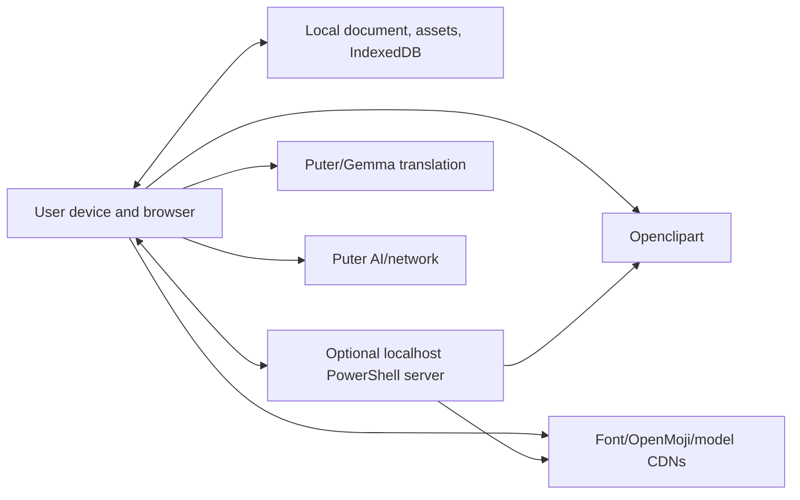

# Security, privacy, and licensing

## 1. Trust boundaries

chicCanva is primarily client-side, but it is not fully offline or network-isolated. The browser processes document state, local image transforms, exports, chroma key, and IMG.LY/ONNX inference. Optional network adapters retrieve assets or call external services.

The selected image is sent to Puter only when the user explicitly initiates a generative request with that image as a reference. AI background removal is local; only model/runtime files are downloaded. Imported PDF bytes and rasterized pages remain in the browser. Direct URL fetch tells the target host the user's IP and ordinary browser request metadata. Known translation terms remain local; when automatic translation is enabled, an unknown phrase is sent to Puter/Gemma only for a signed-in user.

## 2. Local data

Project content can include classroom names, images, and other potentially sensitive material. It is stored in:

- the live JavaScript heap;
- localStorage for preferences, markers, and small fallback snapshots;
- IndexedDB for stable workspace autosave and previous recovery;
- Cache Storage for PWA shell and downloaded background-removal resources;
- exported JSON/PDF/PNG/JPG/ZIP files chosen by the user.

Clearing data from chicCanva removes app-managed autosave, preferences, and model caches. Browser-level storage or downloaded files may remain outside the app's control. Different origins (`file:`, `localhost`, production domain) have separate stores.

## 3. URL-fetch protections

The browser direct-fetch path is restricted by browser CORS. The PowerShell helper has more network authority and must remain constrained:

- accept HTTP/HTTPS only;
- reject loopback, link-local, private, and otherwise non-public destination addresses;
- restrict Openclipart forwarding to expected hosts/routes;
- require image content types for image import;
- impose response-size limits;
- avoid reflecting arbitrary response headers;
- avoid becoming an unauthenticated general-purpose proxy.

Redirects must be revalidated because a public URL can redirect to a private address.

## 4. Untrusted content

- Imported JSON is untrusted. Validate types, sizes, history consistency, object descriptors, and asset data before restoring.
- SVG is active-capable content in general. OpenMoji assets come from a pinned package path; arbitrary uploaded SVG should be treated conservatively and rendered as an image rather than injected as live DOM.
- Openclipart page markup and metadata are untrusted. Insert titles as text, not HTML.
- Project/page names are sanitized before becoming filenames.
- Remote error messages should not be inserted with `innerHTML`.

## 5. Dependency and service licenses

The repository root `LICENSE` licenses original chicCanva code under MIT and records third-party exceptions. The following table is the operational summary; upstream license texts remain authoritative.

| Component/content | Use in chicCanva | License/terms |
|---|---|---|
| Original chicCanva code and documentation | Application logic, build scripts, UI, tests, docs | MIT |
| Fabric.js 5.1.0 | Canvas object model and interaction | MIT |
| jsPDF | PDF generation | MIT |
| PDF.js 3.11.174 | Local PDF parsing and page rasterization | Apache-2.0; bundled license in `development/vendor/pdfjs-LICENSE.txt` |
| ONNX Runtime Web | Local inference runtime | MIT; bundled distribution also carries upstream third-party notices |
| `@imgly/background-removal` 1.7.0 | Local foreground segmentation | GNU AGPL v3; commercial alternatives may be available from IMG.LY |
| OpenMoji graphics and metadata | Emoji browser and inserted SVGs | CC BY-SA 4.0; attribution required, adapted OpenMoji graphics remain share-alike |
| OpenMoji code, if any is reused separately | Upstream tooling/code | LGPL-3.0 according to OpenMoji repository notices |
| Font catalog metadata | Search/wizard metadata assembled for chicCanva | chicCanva MIT for original categorization; font names/metadata may originate upstream |
| Downloaded font binaries | User-selected fonts | Per-font license, commonly SIL OFL, Apache 2.0, or Ubuntu Font License; not relicensed by chicCanva |
| Openclipart artwork | User-selected external clipart | Openclipart represents its artwork as public-domain/CC0; retain source information and verify an individual item if provenance matters |
| Puter JavaScript service/API | Optional generation/network/account usage | Loaded remotely; the upstream Puter repository is AGPL-3.0-only, while hosted-service use is also governed by Puter's current terms and selected provider/service terms |
| Gemma 4 31B through Puter | Optional translation for search text not covered locally | User-pays Puter service and selected model/provider terms |
| Trystero 0.23.1 (`trystero`, `trystero/core`, `trystero/nostr`) | P2P room signaling and WebRTC data transfer | MIT; bundled notices in `development/vendor/trystero*-LICENSE.txt` |
| `@noble/secp256k1` 3.1.0 | Nostr signing dependency bundled through Trystero | MIT; `development/vendor/noble-secp256k1-LICENSE.txt` |
| jsQR 1.4.0 | Local decoding of camera QR frames | Apache-2.0; `development/vendor/jsQR-LICENSE.txt` |
| QR Code generator by Project Nayuki, commit `3c6d0b3cefb4e049dc337e82237c9644399716a8` | Local SVG QR generation | MIT; `development/vendor/nayuki-qr-LICENSE.txt` |

### AGPL release implication

The shipped single HTML embeds IMG.LY background-removal code. MIT does not replace that component's AGPL license. Anyone distributing or offering a modified combined build over a network must evaluate and comply with AGPL source-availability and notice obligations for the covered component and combination. The repository should publish the corresponding source modules and license notices with deployed builds. Obtain independent legal advice for commercial/proprietary distribution or an alternative IMG.LY license.

### OpenMoji attribution

Use the upstream suggested credit in the application, documentation, and distributions:

> All emojis designed by OpenMoji – the open-source emoji and icon project. License: CC BY-SA 4.0.

chicCanva recolors and changes stroke width for black/outline OpenMoji SVGs. Those derived graphics should retain OpenMoji attribution, an indication that color/stroke was modified, and CC BY-SA 4.0 terms.

### Fonts

The catalog does not grant a uniform font license. A font's family page or upstream package is the authority. Do not state that every cataloged font has one license. If a hosted deployment prepackages font binaries rather than fetching them, include the individual font license files.

## 6. Dependency update procedure

For each vendored update:

1. record name, exact version, upstream URL, checksum, and license;
2. preserve banners and third-party notices;
3. check browser and worker compatibility;
4. verify that license obligations are compatible with distribution goals;
5. rebuild the single HTML and both distributions;
6. run static and browser suites;
7. update this document, root `LICENSE`, README, and the in-app license widget;
8. manually test direct-file, localhost, public HTTPS, and PWA update paths.

## 7. Privacy-oriented deployment recommendations

- Publish a short privacy notice identifying optional Puter/Gemma, Openclipart, font, OpenMoji, and model requests.
- Explain that project autosave stays in the browser origin.
- Avoid processing identifiable student photographs through generative services without the appropriate authorization.
- Prefer local background removal when the task does not require generation.
- Use HTTPS and current browser security headers after compatibility testing.
- Keep access logs and proxy logs minimal if the hosted environment adds a server-side image relay.
- Do not add analytics to the editor without explicit product/privacy review.

## 8. Security review checklist

- [ ] Imported JSON validation has size and shape limits.
- [ ] Remote SVG/HTML is never inserted unsanitized into DOM.
- [ ] BAT proxy rejects private destinations after redirects.
- [ ] Puter calls remain explicit and show user-pays information.
- [ ] Background-removal image bytes remain local.
- [ ] PDF document bytes remain local and temporary PDF.js worker URLs are revoked when replaced.
- [ ] Clear-memory removes app storage and model caches.
- [ ] PWA update cannot loop or remain indefinitely on a splash screen.
- [ ] Service worker scope does not capture unrelated site paths.
- [ ] Dependency versions and notices match the shipped bundle.
- [ ] OpenMoji attribution is present and modifications are identified.
- [ ] AGPL-covered source and notices are made available with deployments.
- [ ] Native sharing transfers only the artifact the user chose.
- [ ] PWA inbox records expire and are deleted after import or cancel.
- [ ] P2P manifests enforce item count, size, total size, type, and SHA-256 checks.
- [ ] QR camera tracks stop on success, cancellation, error, and dialog close.
- [ ] Trystero/Nostr/WebRTC privacy and dependency notices are visible in the shipped application.

## 9. Sharing privacy boundaries

Native sharing passes a user-selected generated file to the operating system's share sheet. The PWA share target stores received files temporarily in the application's origin until the user imports or cancels them. P2P transfer uses public Nostr relays for signaling and WebRTC for encrypted peer transport; relay operators can observe connection metadata, and a direct WebRTC peer may learn network-address information exposed by the browser. Project bytes are exchanged only after explicit actions on both devices. QR camera access begins only after the user presses Scan and its tracks are stopped when scanning ends.
