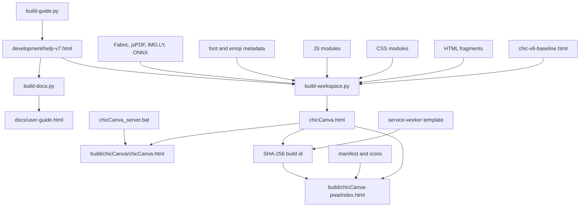
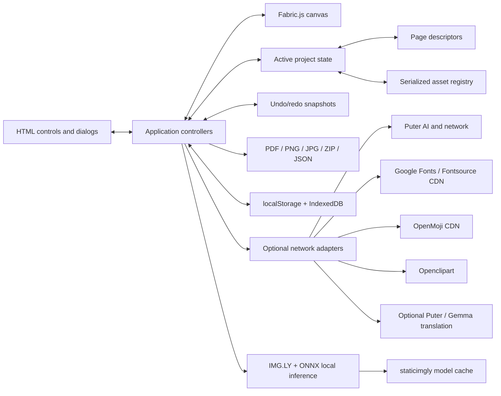
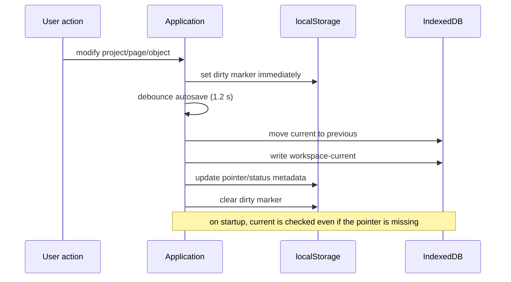
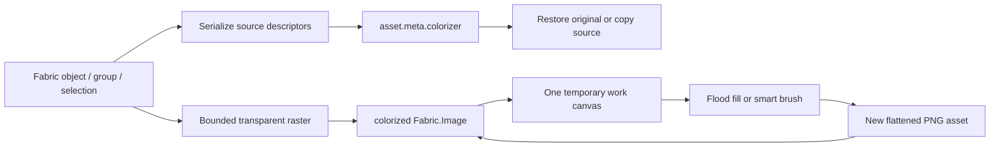

# Technical architecture

This document describes the system and its invariants. Coding agents must also follow the operational contract in [`AGENTS.md`](../AGENTS.md), which maps these architectural rules to approval gates, feature-specific implementation playbooks, and required validation.

## 1. Product boundary

chicCanva is a browser-based, multi-project page composition editor aimed at printable educational material. The shipped editor is one self-contained HTML file. It combines markup, CSS, application JavaScript, the Fabric.js canvas runtime, jsPDF, PDF.js with its worker, an OpenMoji metadata catalog, a font metadata catalog, and the JavaScript portions of the IMG.LY/ONNX background-removal runtime.

The single-file rule applies to the application. Two delivery wrappers add files around it:

- the local Windows distribution adds a PowerShell-only `.bat` webserver;
- the hosted distribution adds a manifest, service worker, and two PWA icons.

Online services and large media/model files remain remote. Puter, Google Fonts/Fontsource font binaries, OpenMoji SVG assets, Openclipart search results, default-enabled Gemma translation fallback, and IMG.LY model data require network access when first used. Known search terms use the embedded dictionary without a request.

## 2. Repository layout

```text
chicCanvas/
├── AGENTS.md                       # coding-agent contract and change playbooks
├── chicCanva.html                 # generated single-file application
├── chicCanva_server.bat           # dependency-free local HTTP server
├── README.md
├── CONTEXT.md
├── LICENSE
├── docs/                          # maintained technical documentation
├── development/
│   ├── chic-v6-baseline.html      # historical integrated baseline used by the composer
│   ├── build-workspace.py         # authoritative application composer
│   ├── build-guide.py             # structured Italian user-guide source
│   ├── build-docs.py              # standalone guide wrapper
│   ├── workspace-ui.html/.css/.js # projects, pages, grouping, special workflows
│   ├── enhancements.css/.js       # toolbar, sidebar, interaction improvements
│   ├── image-effects.html/.css/.js# local image effects, chroma key, eyedropper
│   ├── final-upgrades.css/.js     # unified export, image URL/clipboard, Puter additions
│   ├── ai-generation.css/.js      # curated Puter image profiles, estimate, references
│   ├── ai-annotations.*            # semantic reference markers, editor and temporary raster
│   ├── puter-billing.js            # account balance, unit conversion, pricing cache
│   ├── runtime-upgrades.css/.js   # pinch navigation and Puter auth/account gates
│   ├── memory-ui.html/.css/.js    # memory, image diagnostics, locks, GC, worker lifecycle
│   ├── puter-auth.html            # account gate and reusable login dialog
│   ├── version.json               # public application version
│   ├── pdf-import.html/.css/.js   # PDF selection, rendering, and project insertion
│   ├── vendor/pdf.min.js          # embedded PDF.js display layer
│   ├── vendor/pdf.worker.min.js   # embedded worker, converted to a Blob URL
│   ├── vendor/pdfjs-LICENSE.txt   # Apache-2.0 license copy
│   ├── clipart-ui.html/.css/.js   # Openclipart explorer
│   ├── search-translation.js      # local IT→EN dictionary and Puter/Gemma fallback
│   ├── shapes-ui.html/.css/.js    # vector shape tools and drawing mode
│   ├── interaction-ui.html/.css/.js # transform menus, touch selection, rotation snap
│   ├── pwa-ui.html/.css/.js       # install/update UI and domain gating
│   ├── export-center.html         # export widget fragment
│   ├── workspace-special.html     # special-project UI and preview additions
│   ├── puter-usage.html           # account usage widget
│   ├── font-catalog.json          # embedded searchable font metadata
│   ├── bg-index.mjs               # vendored IMG.LY browser module
│   ├── ort*.mjs                   # vendored ONNX Runtime Web bundles
│   └── pwa/                       # manifest, SW template, source icons
├── tests/
│   ├── v7-tests.js                # source browser regression suite
│   ├── build-v7-tests.py          # creates the test HTML
│   └── check-chic-build.py        # structural/release checks
├── build/
│   ├── chicCanva/                 # final HTML + BAT distribution
│   └── chicCanva-pwa/             # static-host/PWA distribution
└── old/                           # archived historical builds; not a source of truth
```

Several older migration/build scripts remain under `development/` for provenance. New changes should target the modules consumed by `build-workspace.py`, not the historical scripts or `old/` builds.

## 3. Build-time composition

The application has no npm build dependency. Python is used only by maintainers to compose and validate the distributable. End users do not need Python.



`build-workspace.py` performs deterministic string insertion and replacement against the baseline. Assertions on every replacement fail fast if an expected anchor disappears. It reads the semantic display version from `development/version.json`, injects the current ISO build date and absolute social metadata derived from `CHICCANVA_PUBLIC_URL` (defaulting to `https://chiccanva.testthis.one/`), then extracts each inline script and asks `node --check -` to validate syntax through standard input. Node is a developer-side validation aid; setting `CHICCANVA_SKIP_NODE_CHECK=1` skips that check, and a missing Node binary produces a warning instead of making the application impossible to build.

The composer writes one monolithic root HTML and an identical local-server copy. For the hosted PWA it extracts the single style block and four inline JavaScript payloads into same-origin files while preserving document order, leaving the language bootstrap, static metadata, and markup in a lightweight index. It hashes the unversioned index plus all extracted payloads, injects the first 16 hexadecimal characters into the service-worker cache name, and appends the same ID to local CSS, scripts, and manifests as a query parameter.

## 4. Runtime component model



The DOM is deliberately stable and ID-driven. `$()` resolves controls by ID. Feature modules extend or wrap baseline functions after the baseline runtime has been defined. The module injection order matters:

1. baseline runtime and vendored libraries;
2. `workspace.js`;
3. `enhancements.js`;
4. `image-effects.js`;
5. `final-upgrades.js`;
6. `clipart.js`;
7. `puter-billing.js`;
8. `pwa.js`;
9. persistence/runtime override modules, including `pending.js` and `memory-optimizations.js`;
10. final `init()` call.

Many modules preserve an earlier implementation before replacing it:

```js
const imageEffectsBindWorkspace = bindWorkspace;
bindWorkspace = function () {
  imageEffectsBindWorkspace();
  setupImageEffects();
};
```

This pattern composes behavior without a bundler, but it creates an architectural invariant: wrapper order must be preserved, a wrapper must call its saved predecessor exactly once, and generated HTML syntax checks are mandatory.

## 5. State and document model

The editor exposes multiple projects, while much of the canvas engine operates on one active state. `projects` stores project envelopes and `activeProjectId` chooses the active one. On project switches, the current Fabric canvas is serialized into its page, then the target project is restored into the shared runtime.

Conceptually:

```text
Workspace
  projects[]
    id, name, timestamps, exported/dirty metadata
    payload
      version
      state
        settings, current page, grid/snap, sidebar, text/emoji options
      pages.custom[]
        id, name, widthMm, heightMm, objects[]
      assets{}
        id, dataUrl, originalDataUrl, MIME, source, metadata
      history?                 # optional in exported JSON
  activeProjectId
```

Fabric objects are serialized as descriptors with geometry, object type, asset references, crop data, group children, vector shape points/paths, and style. Images point into `state.assets`; assets use Data URLs so an exported project no longer depends on the original local file. Shapes remain geometry-only descriptors and do not add raster assets. This is convenient and portable, although embedded images increase JSON and autosave size.

Pages store real dimensions in millimetres. The editor converts them to display pixels, while exporters render independently at the selected DPI. View zoom never changes print dimensions.

### Group metric updates

Fabric computes a persistent group's bounds from its children when the group is created. Changing a text child's font later changes glyph metrics, so merely assigning `fontFamily` leaves the parent with stale dimensions and can clip or offset the row. chicCanva detaches the group's children into document coordinates, updates every text metric, rebuilds the group, and finally restores the previous visual center. The same path is used for mixed text/OpenMoji groups and groups made only from text. This keeps the composed row stable while giving Fabric a fresh bounding box.

## 6. Canvas architecture

Fabric.js 5.1.0 supplies object selection, active selections, groups, transformations, text, images, clipping, and JSON-friendly object behavior. The application adds:

- page-sized background and guides excluded from project serialization;
- selection box behavior and group-specific purple controls;
- isolated vector drawing with temporary non-serializable previews and editable polygon anchors;
- rotation lock, pan mode, fit zoom, grid, positional snap, and configurable angular snap;
- non-destructive image crop descriptors;
- export-region overlay excluded from normal output;
- serialized object position locks, exposed only in the context menu;
- page save/restore around every project or page switch.

Export-region drawing is a temporary exclusive interaction mode. On entry, chicCanva records each object’s `selectable` and `evented` flags, disables target finding and discards the active selection. On exit it restores the exact previous flags. This lets a region drag begin over an image without moving it and avoids permanently unlocking an object that was already fixed.

There are three coordinate spaces that must not be confused:

1. **document space**, used by Fabric objects and page descriptors;
2. **viewport space**, transformed by zoom and pan;
3. **raster backing-store space**, scaled by CSS size and device-pixel ratio.

The canvas eyedropper intentionally reads raster space because it must sample what the user sees. It maps browser coordinates through the canvas bounding rectangle:

```js
function canvasRasterPoint(event, element = canvas.lowerCanvasEl) {
  const source = event?.touches?.[0] || event?.changedTouches?.[0] || event;
  const rect = element.getBoundingClientRect();
  return {
    x: clamp(Math.floor((source.clientX - rect.left) * element.width / rect.width), 0, element.width - 1),
    y: clamp(Math.floor((source.clientY - rect.top) * element.height / rect.height), 0, element.height - 1)
  };
}
```

Using `canvas.getPointer()` here would return document coordinates and produces incorrect colors after zoom, pan, or Retina scaling.

Settled editor zoom keeps Fabric's logical coordinate system unchanged and changes the CSS display size of both lower and upper canvases together. A dynamic Retina multiplier rebuilds the backing raster after the zoom settles, subject to a pixel budget. Pinch temporarily transforms the common canvas shell to avoid reallocating two large bitmaps on every pointer movement; at gesture end the transform is cleared, Fabric dimensions and offsets are recalculated, and all object controls return to the same document coordinates.

### Colorizer v2 representation

A Colorizer result has three durable parts:

```text
colorized asset
  dataUrl                 rendered PNG shown by Fabric
  meta.colorizer
    baseAssetId           immutable raster used for every recomposition
    sourceDescriptors[]   editable object/group restoration source
    maskDataUrl           24-bit region labels encoded as lossless PNG
    layers[]              region id + solid/gradient/texture style
    operations[]          compact user-facing operation metadata
```

The live session decodes `maskDataUrl` to one `Uint32Array`; one integer per pixel identifies the applied region. The compositor always starts from `baseAssetId`, then paints each region from its layer style. This makes restyling and erasing deterministic: clicking an already labeled area changes its layer, while secondary click/long press clears the entire connected label. Gradient bounds are derived from the region mask and radial centers use the user's fill point. Brush stamps made during one pointer gesture share one label and create one undo step. Adjacent labels with identical styles are merged so a brush closure and subsequent fill behave as a continuous colorization.

The original source is a dependency, not another decoded canvas. Asset reachability traverses `baseAssetId` and `sourceDescriptors`, including nested groups and history snapshots. Ending the mode clears the work canvas, decoded base pixels, labels, cursor and animation frame; the browser may then reclaim the large buffers while the compressed assets remain available for restore and undo.

## 7. Persistence architecture

Preferences and small synchronization markers use `localStorage`. Workspace autosave uses IndexedDB as the durable store, with stable `workspace-current` and `workspace-previous` records. A dirty marker is written immediately; the serialized workspace is committed after a 1.2-second debounce. Small payloads also receive a synchronous localStorage fallback during page leave.

The current and previous IndexedDB entries are small pointers to deliberate recovery generations stored on disk. Rotating a save moves the pointer rather than reading the preceding multi-megabyte JSON into JavaScript. Inside each generation the active project is represented only by the root payload; its workspace entry contains `payloadRef: "root"` rather than another full asset-bearing copy. Project switches clone descriptor shells while retaining immutable Data URL string references, preventing transient copies proportional to every image. The serialized string is not retained after a successful commit. Legacy full records remain readable and are migrated on the next successful save.



Asset liveness is computed from current pages and retained undo/redo entries. Garbage collection follows history truncation, redo-branch replacement, page/object deletion, and explicit project close. The independent last AI reference and internal clipboard remain roots because users expect them to survive page edits. This removes unreachable Data URLs without weakening undo or cross-project paste.

The sidebar load indicator combines three intentionally different estimates: encoded asset bytes across open projects, decoded bitmap bytes for unique images on the active page (`width × height × 4`, including group children), and origin storage usage/quota from `navigator.storage.estimate()`. It is diagnostic rather than a promise of exact process RAM because the browser may share decoded resources or hold internal GPU copies.

The first meaningful pointer or keyboard interaction asks `navigator.storage.persist()` for persistent origin storage when supported. Browsers may still refuse, and private browsing can discard data. Exported JSON is therefore the archival format; autosave is recovery assistance.

## 8. PWA architecture

PWA behavior is enabled only for a real HTTPS hostname. It is suppressed for `file:`, localhost, loopback/IP hosts, `.local`, and private network addresses. This avoids presenting the local BAT session as an installable production application.

The service worker uses a SHA-derived shell cache. Navigation tries the current network document first with a four-second bound and falls back to the cached shell offline. Build-versioned asset URLs keep a fresh document paired with its matching CSS and JavaScript even while the previous worker is still active. A newly installed waiting worker is not forced into the active page silently: the UI displays an update bar, sends `SKIP_WAITING` only after the user acts, and reloads on `controllerchange`.

Large external model/font/image resources are runtime caches and are not guaranteed offline until fetched. The service worker does not turn Puter or remote search into offline features.

## 9. Local webserver architecture

`chicCanva_server.bat` launches a PowerShell `HttpListener` on `localhost:8000`. It has no Python, Node, npm, or package-manager dependency. It serves the HTML and implements narrowly scoped helper routes used when the browser is blocked by remote CORS:

- public image download with content-type and size limits;
- Openclipart search forwarding;
- request validation that rejects local/private destination addresses.

The launcher is a convenience boundary, not a general open proxy. Keep its allowlists, protocol checks, file-size limits, and private-address rejection when modifying it.

## 10. Architectural trade-offs

### Single-file strengths

- easy copying and classroom use;
- direct-file mode for core editing;
- no runtime build tool or package installation;
- a project can be inspected by opening one file;
- local privacy for editing and most transformations.

### Single-file costs

- generated HTML is about two megabytes and difficult to maintain directly;
- module composition relies on ordered function wrapping and stable anchors;
- embedded catalogs and libraries make diffs noisy if generated artifacts are reviewed;
- browser parser failure in any inline script can disable the entire application;
- source maps and conventional module-level debugging are limited.

The current mitigation is a modular authoring layer, assertion-based composition, inline JavaScript syntax validation, static DOM/reference validation, and a broad browser regression suite.

## 11. Invariants for future work

1. Preserve a single application HTML in both distributions.
2. Edit modular sources; regenerate artifacts.
3. Preserve direct-file behavior for local features and visibly disable HTTP-only widgets.
4. Do not silently call paid/user-pays services. Puter actions require an explicit user action.
5. Preserve originals for crop, background removal, grayscale, outline, and AI post-processing.
6. Keep page dimensions independent from view zoom.
7. Save assets with the project or make their remote dependency explicit.
8. Keep mobile background removal on the small model and release worker memory after each job.
9. Update the user guide, technical docs, context, build copies, and tests with material changes.
10. Treat IMG.LY AGPL obligations and OpenMoji attribution/share-alike terms as release constraints.


## Viewport rendering and navigation

Pinch gestures use lightweight CSS sizing for every animation frame and rebuild Fabric’s retina raster only once when the gesture ends. This avoids clearing and reallocating the backing canvas while fingers are moving. Non-fit zoom creates navigation padding equal to 75% of the visible viewport on every side, allowing the hand tool to move all page edges through the useful center area. Zoom changes preserve the current page-space center.
# Search translation response normalization

Emoji and Clipart searches first tokenize the Italian phrase and replace known terms from the embedded dictionary. If unknown tokens remain and Puter is already authenticated, chicCanva sends the compact prompt below to `google/gemma-4-31b-it`:

```js
const input = searchTranslationInput(keyword);
const prompt = JSON.stringify(input.raw.slice(0, 160)) +
  ' -> translate IT to EN. Text in (...) is context only: use it to choose meaning, do not output it. Output translated search text only. If input is already EN, output it unchanged. Choose one best synonym. Context: emoji/clipart search for drawing, creative and educational projects.';
```

The request uses `normalize:true`. Current Puter therefore places the answer in `message.content` and provider reasoning in `message.reasoning`. `normalizedPuterText()` deliberately reads content first; it also removes complete and unterminated `<thought>`, `<thinking>`, `<reasoning>` and `<analysis>` blocks, strips common answer wrappers, and accepts the last non-empty line as a compatibility fallback. Keep this parser whenever the model or Puter response adapter changes; otherwise search can accidentally receive the reasoning trace instead of the English keyword.

# Puter image request contracts and estimates

`development/ai-generation.js` keeps the user-facing catalog separate from Puter's request payload. Each profile stores the exact model ID, optional provider pin, supported qualities, base published price, reference capability and safety flag. `aiRequestOptions()` maps those profiles to Puter's documented provider contracts:

- OpenAI Image uses `provider: 'openai-image-generation'`, `quality`, and `ratio: {w,h}`; with custom output enabled, `w` and `h` are the calculated pixel dimensions rather than a reduced ratio;
- xAI uses the canonical namespaced Grok model ID and `quality: '1k' | '2k'`, relying on Puter's model inference as shown by the model card;
- Seedream and Gemini 3.1 Flash Lite Image use their canonical namespaced IDs without a forced provider, dimensions or fallback model. Juggernaut, HiDream and Qwen remain hidden because live requests were rerouted by Puter to an unavailable FLUX endpoint;
- image references use the cross-provider `input_images` array plus `input_image_mime_type`.

The reference scale control renders a temporary PNG with `imageSmoothingQuality='high'`, supports 0.25× through 3× with 1× as the default, frees its temporary canvas after encoding, and never rewrites the project asset. OpenAI quality tiers remain independent from custom raster size. `aiOpenAiDimensions()` treats the preset selector as an approximate short edge; exact mode uses `aiOpenAiCustomDimensions()` and explicit width and height. Both paths validate 16-pixel units, aspect, edge, and total-pixel constraints before request construction. Four controlled Low-quality Puter probes confirmed that documented `ratio:{w,h}` preserves custom dimensions while an undocumented `size` string is ignored. xAI maps its resolution selector to `quality: '1k' | '2k'`.

`development/ai-annotations.js` owns semantic reference annotations for GPT Image 2.5 Flare and Sunburst. Project state stores versioned normalized marker geometry, stable numbers, colors, and user comments in `state.aiReferenceAnnotations`; it never stores a second raster. Rectangle and oval markers keep normalized bounds, while a point marker keeps only its normalized center. The full-screen editor uses a dedicated DOM canvas and independent viewport transform, so zoom, pan and pinch do not touch the main Fabric document. Its gray workspace contains a white image stage; a session-only black-stage toggle changes only the CSS background visible through transparent source pixels and is excluded from project state and request rasterization. On open, alpha detection scans the already bounded preview canvas in 32-row strips and releases each `ImageData` before reading the next strip; the toggle is disabled for an opaque result. Because a modal dialog occupies the browser top layer, opening the editor temporarily reparents the shared `desktopTooltip` into the dialog and closing restores its exact original parent/sibling position. A two-pointer gesture cancels an unfinished marker before entering pinch mode. Saving commits the vector data; closing without saving discards the working clone. Replacing or removing the reference clears annotations, while selecting an incompatible model preserves them in storage.

Immediately before an annotated request, `aiAnnotatedReference()` draws the scaled clean reference and numbered overlays into a temporary canvas. `aiRequestOptions()` then sends `[cleanDataUrl, annotatedDataUrl]` through Puter's documented `input_images` field. `aiFullPrompt()` appends a localized technical block defining image roles, normalized coordinates and unchanged user comments, written as `user_comment: {…}` so quotes inside user text do not require JSON escaping. The same composed prompt appears in the raw-prompt dialog and drives token estimation. The input-image estimate is multiplied by two only while saved annotations and a compatible model are active.

`aiGeneratedImageDataUrl()` treats generation and asset ingestion as separate phases. It supports Blob, canvas, data URL and image-element returns, then tries bounded direct fetch, the localhost proxy and Puter network fetch. Failure in the second phase creates `aiPendingGenerated` and the recovery UI instead of throwing away a successful provider result. Retry insertion operates on that retained result and does not call `txt2img()` again. The build also removes the legacy Together catalog containing `black-forest-labs/FLUX.1-schnell`; static and browser tests assert the curated canonical IDs and fail if that old fallback reappears.

`aiPuterGenerationError()` recognizes Puter's `model_not_available` response. It reports the requested canonical ID and any server-side FLUX reroute while deliberately avoiding an automatic substitute that could change output semantics or consume a different number of credits. Live provider smoke tests are documented in `FEATURES_AND_PROCESSES.md` and should be repeated when Puter changes routing.

`txt2img()` normally returns an `HTMLImageElement`. `aiGeneratedImageDataUrl()` first accepts embedded `data:` output or a browser-readable Blob/URL. Only when a remote output URL is blocked by CORS does it retry through `puter.net.fetch()`, with a bounded timeout. This conversion is required because project autosave and JSON export must retain the generated bytes rather than an expiring remote URL.

`development/puter-billing.js` reads `getUser()` and `getMonthlyUsage()` together and optionally reads `getDetailedAppUsage(puter.auth.appID)` for the separate app scope. It prefers `usage.allowanceUsed`, otherwise `usage.total`, and derives usage only from `monthUsageAllowance + purchasedCredits - remaining` when those fields are consistent. Live `allowanceInfo.unit` selects Credits, microcent, cent, or USD conversion. The current observed Credits scale is 2,000 Credits per dollar.

Image preflight pricing is normalized from `https://api.puter.com/puterai/image/models/details` into formula-specific records for only the visible models. The result lives in localStorage for 30 days. Unknown/zero values never overwrite reviewed coefficients; failed refresh keeps stale cache, then falls back to the embedded table. GPT Image 2.5 output uses OpenAI's public non-linear token-calculator formula. Prompt text uses a character/token heuristic and reference images use a labelled Vision-derived patch proxy because no GPT Image 2.5 preflight input formula is published. Estimates remain local and show whole Credits plus USD to three decimals. See `PUTER_BILLING_AND_PRICING.md` for field mappings, formulas and test fixtures.

## Prompt Library storage

The Prompt Library uses its own `chicCanva-prompt-library` IndexedDB database and `prompts` object store. Separating it from project autosave avoids rewriting every project when one reusable prompt changes. An entry can retain a Data URL reference, so references are strictly opt-in. The editor can write prompt text or the optional image as a PNG-compatible Clipboard item; the AI widget can read text and append it after a blank line. Import/export uses `{type, version, exportedAt, prompts}` and browser memory clearing explicitly clears this store.

The system clipboard image command is also separate from the editable internal clipboard. Right-click or long-press on the Copy toolbar button renders a group or active selection to a bounded transparent PNG. A single unrotated image reads its native asset directly: without crop it preserves the source blob; with crop it extracts `cropX`, `cropY`, `width`, and `height` into a same-resolution PNG without display-scale resampling. The image inspector exposes the original and cropped variants explicitly. The clipboard compatibility helper falls back to PNG for formats rejected by the browser.

Selected-image quality replacement uses progressive high-quality canvas resampling for reductions and one high-quality interpolation pass for enlargement. Resolution factors include intermediate steps and 1×. After resampling, an independent PNG-quality stage optionally quantizes RGB precision while preserving alpha; 100% skips quantization. This ordering keeps geometry and text-edge resampling independent from compressed storage size. The derived asset records `resolutionFactor`, `pngQuality`, dimensions, encoded bytes, and resampling mode; Fabric scale and crop coordinates are adjusted inversely so physical placement remains unchanged.

# Colorizer raster pipeline



The implementation lives in `development/colorizer-ui.html`, `development/colorizer.css`, and `development/colorizer.js`. `objectType: "colorized"` uses the normal image descriptor fields (`assetId`, crop rectangle, pose, flips, opacity) and is accepted by the existing image/crop tools. Its asset metadata contains `sourceDescriptors`, `basePose`, and bounded operation summaries.

The page contains only the derived Fabric image. There is no hidden original object and no permanently decoded second bitmap. A session decodes the current asset once into an offscreen 2D canvas with `willReadFrequently`. The optimized brush queues pointer samples and consumes them at most once per animation frame while retaining the original `brushSize / 5` interpolation step. Reusable `Uint8Array` membership maps and growable `Uint32Array` index buffers replace per-pixel JavaScript `Set` entries and the full label-map cancellation copy. The modified object is previewed through a pointer-transparent DOM canvas above Fabric; only the edited object is drawn there, using the current retina and viewport transforms. Pointer-up drains the final samples, merges touching compatible labels in the canonical mask, performs one complete composition and encodes one PNG. Fill continues to use the same canonical label map and contour-aware compositor directly. A commit swaps in a decoded image element and releases the old element reference. Session shutdown removes the overlay, clears the context and shrinks the surface.

The previous brush pipeline remains in the source as a runtime fallback. `?colorizerBrush=legacy` selects it for the current URL, while `setChicCanvaColorizerBrushEngine('legacy')` stores a persistent override; `optimized` selects the new path. The global memory reset removes the persistent override. This switch affects pointer sampling and preview only: project serialization, masks, edge adhesion, fill, layer merging and undo granularity are shared.

Flood fill uses a `Uint8Array` visited map and marks pixels when enqueued, preventing duplicate queue growth. Initial rasterization caps the longest dimension at 3072 pixels. This bound keeps a full RGBA `ImageData`, visited mask, and working queue within a predictable browser-memory envelope while preserving good print resolution for ordinary worksheet elements.

Derived-asset collection is dependency aware. `expandDerivedAssetDependencies()` walks `meta.colorizer.sourceDescriptors` transitively after collecting page and history object IDs. Therefore pruning a project keeps source images required by restoration, including nested colorized results, and removes them only after the derived object and every history state cease to reference them.

The non-destructive state is represented as follows:

```js
asset.meta.colorizer = {
  version: 1,
  sourceDescriptors: [/* text, image, shape or group descriptors */],
  basePose: { x, y, width, height, angle: 0 },
  operations: [{ tool, paint, colorA, colorB, opacity, tolerance, at }]
};
```

The operation list is diagnostic and UI metadata; the flattened PNG is authoritative. This keeps reload deterministic and avoids replaying many masks during page load.

## Sharing and transfer architecture

`development/file-sharing.html`, `.css`, and `.js` own native file sharing, incoming PWA files, QR capture, relay diagnostics, and Trystero sessions. They depend on the existing export serializers and artifact builders instead of maintaining parallel formats. `development/vendor/chic-transfer-vendor.entry.js` is the maintained bundle entry; `chic-transfer-vendor.js` is the browser IIFE containing Trystero 0.25.3, jsQR 1.4.0, and `nayuki-qr-code-generator` 1.8.0. The composer exposes it as `globalThis.ChicTransferVendor` before the feature module runs. It is embedded in the monolithic application and emitted into the generated PWA script, so there is no package-manager or CDN runtime dependency.

The service worker handles the manifest `share_target` POST before ordinary GET/cache routing. It retains incoming `File` values temporarily in the dedicated `chicCanva-share-inbox` IndexedDB database and redirects with an opaque inbox ID. The application consumes that record only after saved-workspace recovery, classifies the file from MIME type, extension, and bounded content probes, and dispatches it through the established project, Prompt Library, PDF, or image importer. The main workspace database and project schema do not change.

The P2P protocol uses `manifest`, `request`, `payload`, `done`, and `error` actions through Trystero's object action API. Manifests carry stable item IDs, type, display name, byte length, and SHA-256. Receivers commit only a requested complete set after length and digest validation. Stable project JSON and Prompt Library JSON remain the interchange formats. WebRTC peers, relay sockets, camera streams, timers, receive buffers, and temporary inbox records never enter project state, history, or autosave.

Both peers derive the same five-relay subset from the one-time-code hash and a maintained internal Nostr relay pool. This distributes sessions while guaranteeing common signaling endpoints without lengthening the human code. A validated `wss://` custom relay may be stored in `localStorage` and is added to that common subset; it never replaces the internal fallback. Socket readiness is observed through `getRelaySockets()`. The dialog distinguishes connecting, relay-ready, peer-ready, and failed signaling states, and offers relay configuration after a bounded all-relays-unreachable timeout.

### Startup viewport stabilization

Saved-workspace recovery is a viewport transition. From the moment the startup dialog closes until project tabs and the active page finish restoring, `fitStageZoom()` is restricted to CSS-only previews. `ResizeObserver` notifications are coalesced across two animation frames and one final forced raster update. This prevents alternating dialog and workspace measurements from repeatedly rebuilding the Fabric backing store. The transition captures and restores `zoomMode`, including numeric values produced by Ctrl+wheel or pinch.

## MEGA connector boundary

The cloud feature is split into `cloud-storage.html`, `cloud-storage-dialogs.html`, `cloud-storage.css`, and `cloud-storage.js`. MEGAJS 1.3.10 is vendored into the composed application before the connector module; no additional file-explorer framework is used. The custom explorer consumes MEGA node objects but never serializes those live objects into project state, history, or autosave.

MEGA connectivity is supported when chicCanva is hosted over HTTPS or opened from a secure loopback development host (`localhost`, `127.0.0.1`, `::1`, or `[::1]`). The capability probe also requires `isSecureContext`, Web Crypto, and the lexical `mega.Storage` export injected immediately before the connector module. The vendor bundle deliberately stays inside the composed application scope instead of publishing `globalThis.mega`; using the global object for this probe would incorrectly disable the connector on every origin. Ordinary HTTP domains, LAN addresses, and the monolithic `file://` editor retain disabled cloud controls with an explanation in the sidebar. PWA output is generated from the same source and therefore uses the identical connector, dialogs, localization, and artifact builders.

Cloud preferences extend the existing preferences record without changing project JSON version 7. The MEGA session secret lives in a separate IndexedDB database, while backup instance ID, sync session ID, writer ID, observed revision, last successful Sync timestamp/hash, and suspension state are small non-secret local metadata. Missing fields receive backward-compatible defaults. Cloud work begins only after the local stable-generation write succeeds, preserving local recovery as the primary durability boundary.

Cloud run diagnostics use `chicCanva.cloud.run-log.v1` in localStorage. The bounded 100-entry array stores only operation kind, timestamp, automatic/manual source, outcome and a short detail string. Runtime status is derived from the newest entry, so language changes rerender labels without translating persisted data. Clearing application memory removes the log together with Cloud metadata. Both automatic and explicit runs update quota in `finally`; explicit runs serialize the same full workspace snapshot used by autosave and call the normal safe Backup/Synch paths with deduplication bypassed.

Synch uses immutable revision folders and a manifest-last commit. Before uploading, a client refreshes and rejects any remote revision newer than its observed revision. It then acquires a short lease, refreshes again, uploads to a unique revision folder, and verifies both the manifest baseline and lease ownership immediately before publishing `current.json`. Cleanup runs only after publication; failed attempts remove their unpublished folder and preserve the old manifest. The lease expires after 90 seconds and is released in `finally`, so a crashed writer cannot permanently lock the session. This is best-effort coordination over MEGA file operations rather than an atomic distributed transaction.


### Cloud explorer preview and connection feedback

The explorer temporarily hosts the shared tooltip in the modal top layer and restores it on close or Escape. Selecting a folder exposes an Open action in its details; double-click uses the same navigation helper. Dot-prefixed nodes, including `.backups` and `.synch`, are always included without filtering. Image previews show encoded file size and decoded pixel dimensions on a checkerboard; PDF frames expand into the remaining preview height. A generation counter rejects stale preview downloads after another selection or close. Memory settings use a separate live connection status, preserving the backup result log. The bilingual account explanation links to MEGA and the guide recommends a dedicated account; saved session data are encrypted locally and cloud files are transferred directly to MEGA.
