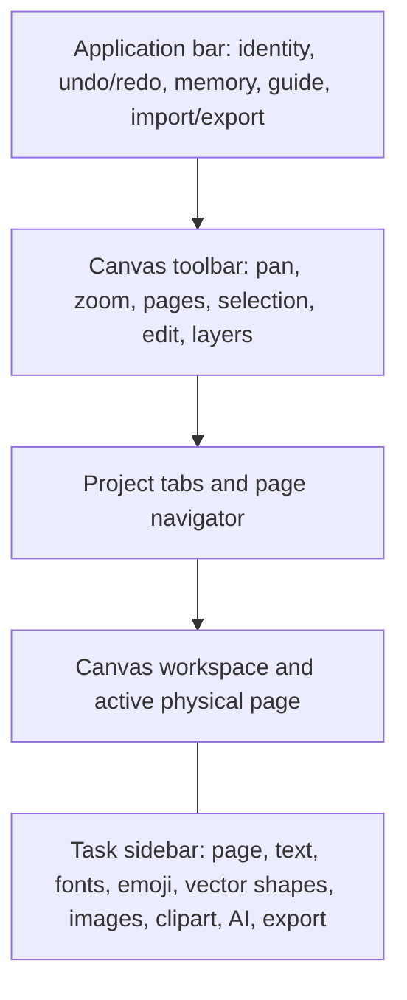

# UI and UX architecture

The complete project strip, including the trailing New Project action, scrolls horizontally as one unit on narrow screens. Project labels have a bounded visual width and use ellipsis on desktop and mobile while preserving the full stored name and tooltip. The strip reserves 5 px below its controls so the native scrollbar sits clear of project buttons at every width.

## 1. Audience and interaction goals

The primary user is a teacher preparing printable material, often without design-software training and sometimes on a phone or tablet. The interface therefore favors recognizable actions, reversible editing, preserved originals, contextual widgets, and print-oriented terminology. Advanced capabilities remain available without requiring the user to understand the internal object or asset model.

Core UX principles:

1. **The page is the center of attention.** Controls should not cover a fitted page.
2. **One visible task at a time.** Sidebar sections start collapsed and “expand one section” is the default.
3. **Operations are explicit.** Puter generation, assisted download, project replacement, and destructive actions require a clear user action.
4. **Touch navigation is direct.** Two fingers zoom around their midpoint and pan in the same gesture while object editing is temporarily suspended. Pinch start rolls back any transform or temporary action begun by the first finger, clears target finding during the gesture, and restores the exact prior selection afterward. Colorizer, shape drawing, export-region drawing, and eyedropper sampling remain blocked through the final pointer release; a short compatibility-click guard prevents that release from becoming a delayed tool action.
4. **Derived image workflows preserve the source.** Crop is reversible; grayscale, outline, and background removal create copies.
5. **View and output are separate.** Zoom, pan, grid, guides, and selection boxes never alter physical output.
6. **Mobile uses the same document model.** Layout changes, while projects and exports remain compatible.

## 2. Interface regions

The application bar owns workspace-level actions. The canvas toolbar owns view and selected-object actions. Project tabs and page navigation sit close to the canvas because they change its content. The right sidebar is activity-oriented and can be resized or hidden on desktop.

## 3. Sidebar information architecture

Quick-jump buttons represent the main tasks:

- Page
- Special workflows
- Text
- Fonts
- Emoji
- Shapes and drawing
- Images
- Clipart
- AI
- Export

Clicking a quick jump opens its category before scrolling. With single-section mode enabled, opening a section closes the others. “Expand all” and “Collapse all” intentionally disable single-section mode because those commands express a different layout preference.

Sections start collapsed on each application launch. This prevents a previously used, content-heavy widget such as Clipart from dominating mobile startup and reduces initial layout work.

## 4. Desktop behavior

Desktop uses a resizable right sidebar and a scrollable toolbar. Fit zoom calculates the available canvas region after the sidebar width is applied and centers the page in that region. Changing page orientation, opening/closing/resizing the sidebar, or selecting Fit triggers recomputation rather than preserving an obsolete offset. Opening, closing, or dragging the sidebar preserves the active zoom mode on desktop and mobile: Fit adapts to the new viewport, while an explicit percentage remains unchanged.

Hover tooltips explain icon-only toolbar controls. Every icon-only control also has an accessible name. The delete action uses a visible vector icon rather than a font glyph, avoiding missing-glyph boxes and inconsistent emoji rendering.

The main canvas toolbar remains a single horizontal strip at every width, retains its native horizontal scrollbar when its commands overflow, and reserves a few pixels below the controls so the scrollbar does not crowd mouse or touch targets. An ordinary vertical mouse-wheel gesture over that overflowing toolbar also scrolls it horizontally without requiring Shift. While the sidebar divider is dragged, canvas previews are coalesced to one compositor update per animation frame and retain the zoom mode active when the drag began. Fabric recalculates offsets, controls, and the sharp backing raster once when the drag ends, preventing resize feedback while preserving both the final viewport geometry and an explicit zoom level.

Context menus supplement, rather than replace, visible commands. Object menus expose copy, paste, group, ungroup, split, duplicate, duplicate as image, layers, crop, background removal, AI reference actions, and **Fix position** where applicable. A lateral Rotate and flip submenu provides reset, ±90°, 180°, horizontal flip, and vertical flip. The same transformations are available by right-click or long press on the rotation toolbar icon. Fix position is intentionally context-only: it locks movement, scale, skew, and rotation without adding another permanent toolbar control. Project and page context menus expose rename and related lifecycle actions.

The semantic reference annotation editor is a focused overlay rather than a sidebar workflow. On desktop it keeps a small outer margin and rounded corners; mobile uses the full viewport. A compact icon toolbar leaves the image as the dominant surface and has enough bottom space that its horizontal scrollbar cannot cover touch controls; Fit uses a four-corner vector icon instead of a text-width-dependent button. Its icon controls and comment-panel handle use the shared localized `desktopTooltip`; while the modal is open that existing tooltip node is temporarily hosted inside the dialog's browser top layer, then restored on close. The workspace outside the image is gray; the image stage is white by default and a toolbar command can switch that non-destructive transparency preview to black. That command is enabled only after transparent preview pixels are detected; an opaque reference keeps the control disabled and explains why through its localized tooltip. Marker comments appear in a fixed-height bottom overlay panel that never resizes the canvas and animates only its compositor transform. The closed panel may use layout containment but never paint containment, because its interactive handle intentionally protrudes above the translated panel and must remain visible. It opens automatically for a new marker, but automatic textarea focus is limited to fine-pointer devices so a mobile keyboard cannot resize the viewport during the opening animation. With no marker selected the panel lists all annotations. Destructive delete-all remains behind right-click or long press on the selected-marker delete command. The page Preview overlay follows the same desktop margin and mobile full-screen rule.

The selection toolbar icon also owns a context menu. **Selection by object** keeps a cumulative set: each tap toggles one object while movement is temporarily locked. This gives touch users the Ctrl-click workflow without requiring a hardware keyboard. Escape or the explicit Stop action restores the exact prior movement/control flags and keeps the resulting selection.

On narrow touch layouts, the preview header uses three grid rows: title and Close, thumbnail-size control, then reorder controls. This guarantees that Close remains visible. Long-press-enabled UI suppresses browser text selection and the native callout while preserving text selection inside inputs and editors.

## 5. Mobile and installed-PWA behavior

On small/coarse-pointer screens:

- the sidebar becomes an overlay that can be closed to reveal the full canvas;
- toolbars scroll horizontally without wrapping individual actions into unexpected rows;
- the install action is icon-only and compact;
- page reordering remains possible with arrow buttons instead of requiring drag precision;
- using the eyedropper closes the sidebar so the user can touch the canvas;
- AI background removal is constrained to the small model and a disposable worker;
- physical page preview preserves portrait/landscape orientation at a comparable long-edge scale.
- a stationary 1.4-second press on an object opens its context menu; moving more than a small threshold or scrolling cancels the gesture.

The installed PWA uses the same origin storage as its browser counterpart for the same URL. Startup recovery reads IndexedDB even when a small localStorage pointer is absent. The application requests persistent origin storage after the first meaningful interaction because some mobile browsers require a user gesture.

## 6. Selection and manipulation states

The canvas distinguishes three optional alignment aids. The grid is visual, classic snap quantizes coordinates to the configured millimetre step, and magnetic guides align the moving selection to page centers, object anchors, or equal gaps. Magnetic guides default on and expose independent sub-options in the Canvas section. A right click or long press on the Snap toolbar button opens the same controls without moving the sidebar. Magenta lines represent page/object alignment; teal segmented references represent equal spacing. All helpers disappear when the gesture ends.

Aspect locking defaults off so side handles can stretch an object. Enabling it preserves the ratio that existed at the beginning of a resize or crop. Shift reverses the saved choice for one gesture. Shape drawing has a separate 1:1 option because a teacher may want square cards while retaining free resizing for existing objects. During movement, Alt reverses magnetic guides; Shift+Alt suppresses guides and reverses classic snap. These temporary modifiers never change the saved checkboxes.

The toolbar makes modes explicit:

- hand/pan;
- normal selection and marquee;
- rotation enabled;
- crop;
- export-region drawing;
- vector shape, polyline/polygon, and freehand drawing;
- grid visibility;
- snapping.

Shape drawing follows the same isolation rule as export-region drawing: existing objects temporarily become non-selectable and non-evented, and target finding is disabled. A crosshair and an active tool tile make the state visible. Escape and the sidebar cancel command restore the exact previous interaction flags. Polygon point editing is a separate state applied only after a completed object is selected.

Rotation is disabled by default to prevent accidental changes while resizing. Group selection uses a thicker purple boundary to distinguish a persistent group from a transient multi-selection. Crop and export selection are visually and behaviorally distinct: crop begins at the current visible image boundary, cannot exceed the original source, and changes one image's visible window; export selection defines output bounds only. Export-region mode suppresses object hit testing until it ends, so starting the rectangle over a photo cannot move the photo. The image inspector places **Copy image** beside **Change quality**. Without a crop it copies the original immediately; with an active crop it opens the persistent **Copy original / Copy crop** menu, which closes only after a command, an outside click, or Escape. **Change quality** presents independent resolution and PNG-quality sliders; 1× changes compression without changing dimensions. Image output exposes **Copy to clipboard** only for a single page or region, where the result is one unambiguous image rather than a multi-page ZIP.

Keyboard support includes common editing conventions (`Ctrl/Cmd+C`, `V`, `D`, `Z`, `Y`, `S`) plus feature shortcuts (`F`, `H`, `G`, `R`, `F1`). Shortcuts are ignored while typing in form fields.

## 7. Dialog policy

Native browser dialogs are avoided for core workflows because they are visually inconsistent and hard to test. Application dialogs are used for:

- new/rename/close project;
- rename/delete page;
- PDF scope;
- URL import and optional Puter transport;
- PDF import modal with source-page scope, project destination, A4 orientation, and resolution controls;
- Clipart preview;
- autosave recovery;
- settings and memory clearing.
- image quality replacement, including independent resolution, PNG color precision, projected pixel, and bitmap-memory values.

A dialog should state the affected project/page, the consequence, and the reversible or recovery path. The primary action should describe the operation, while cancel remains visually secondary.

## 8. Loading and progress feedback

Any action that may exceed a perceptible delay needs immediate feedback:

- Clipart search shows a global spinner and per-thumbnail loading states;
- AI generation shows a spinner/status and disables its launch button;
- background removal shows stage/progress text plus a scan effect over the duplicate workflow;
- large exports report page number progress;
- font and emoji loading update previews only after usable assets arrive.

Busy state begins before translation, fetch, dynamic import, or model initialization. Controls are restored in `finally` so errors do not leave the interface permanently disabled.

## 9. Color controls and eyedropper

Every HTML color input receives a neighboring vector eyedropper button at binding time. This covers current and future color selectors without duplicating markup. The canvas enters a clear crosshair mode and displays a short toast. Escape cancels.

Sampling uses the lower rendered canvas rather than the upper control layer, preventing selection borders and handles from contaminating the chosen color. Transparent pixels are represented as white because HTML color inputs cannot express alpha.

In the chroma-key panel, the color/pipette and automatic detection are mutually exclusive. Choosing with the pipette turns off automatic detection. The tolerance slider occupies a full row below color selection to remain usable in the narrow sidebar.

## 10. Accessibility requirements

- Use semantic buttons, labels, inputs, dialogs, tabs, and expanded/collapsed states.
- Every icon-only button needs `title` and `aria-label` or an equivalent accessible name.
- Busy controls expose `aria-busy`; disabled controls use the native `disabled` property.
- Do not convey group state or errors using color alone; pair visual distinction with status text.
- Keep focus within native `<dialog>` behavior and return focus after closing where practical.
- Respect touch target size, especially for page arrows, toolbar icons, and close actions.
- On narrow touch viewports, Fabric selection handles use an 18 px visible control and a 40 px touch hit area. Crop handles use a 20 px marker with a 44 px hit area, and editable vector vertices use the same 20/44 px pairing. Borders are slightly thicker, while mouse/desktop metrics remain unchanged.
- Preserve keyboard alternatives for drag-only interactions.
- Keep the guide usable without hover.

## 11. Content and tone

Italian is the editorial source for user-facing copy; the runtime also supplies a complete English interface. Both languages are task-oriented and aimed at teachers: they explain what to do and what will happen. Project content, names, filenames, user prompts and search results are never translated by the interface layer. Console errors, implementation stack names, and developer debugging procedures belong in technical documentation. Necessary service/license names may appear where they affect privacy, cost, or attribution. See [LOCALIZATION.md](LOCALIZATION.md) for selector behavior, language persistence, guide parity and AI prompt rules.

The internal guide is an illustrated handbook for teachers and other non-technical users. Tooltips answer “what is this button”; widget help answers “what happens here”; the guide explains what is available, where to find it, how to use it, which option to choose, and what result to expect. Every feature topic includes a practical case with a goal, steps, expected result, creative follow-up, and at least one localized screenshot of the real section used for that feature. Localized screenshots reproduce the current interface exactly and are embedded in the standalone single-file guide without external image requests. The icon atlas reuses the application’s actual marks and explains direct toolbar actions. Context menus have a separate indexed reference with the object, project, page, image-copy, and annotation variants, linked from relevant feature chapters. AI chapters introduce Puter, prompts, model choice, usage estimates, references, and recovery in operational language. Developer internals remain in technical documentation. The desktop guide dialog uses most of the available viewport width for readable tables and visual references; its sticky contents column is capped to the dialog’s usable height and scrolls internally. Mobile retains the compact modal, where the grouped, expandable contents panel remains sticky below the dialog header and collapses after choosing a topic, so navigation stays reachable without returning to the beginning.

## 12. UX regression checklist

When changing layout or controls, verify at least:

- Fit centers portrait and landscape pages with sidebar open and closed;
- toolbar controls do not wrap into overlapping rows at mobile width;
- all sidebar cards are collapsed on fresh startup;
- quick jumps open the expected card;
- tolerance and other ranges remain full-width and touchable;
- icon-only actions remain visible without webfonts;
- page preview gives landscape pages a landscape container;
- modals name the target and cancel safely;
- eyedropper samples correctly at 50%, 100%, 200%, Fit, and after pan;
- a long project/page name does not break tabs or navigation;
- export-region drawing started over an object never changes that object;
- context-menu locking survives save/restore and a long press does not fire after a drag;
- image diagnostics update through groups and resolution replacement preserves physical geometry;
- online-only widgets are disabled with the approved message in direct-file mode.

## Zoom motion quality

The pinch interaction prioritizes continuity: each gesture frame changes only presentation size and scroll position, then a single final raster refresh restores full display quality. The hand tool receives viewport-relative free space around a zoomed page so users can bring any edge or corner into the center instead of hitting an early horizontal scroll limit.
# Colorizer interaction model

Colorizer appears directly below **Images & Crop** and has a matching quick-navigation button between Images and Clipart. The shared accordion controller discovers every current top-level sidebar card at interaction time, so Colorizer and Shapes obey single-section, expand-all and collapse-all exactly like built-in widgets. The selection status distinguishes an ordinary eligible object, a colorized result, and an active coloring session. Primary actions are ordered as Start, Finish, and Restore original so destructive-looking restoration is never confused with leaving the tool.

During the mode the selected object is not movable or selectable and the canvas uses a crosshair. Fill is a single click or tap. Brush is a press-drag-release gesture with a circular cursor on pointer devices; the whole gesture is one history entry. The smart brush remains inside the connected component sampled at gesture start, so moving the pointer across a line cannot resume on the other side. With edge protection disabled, the stroke paints continuously across outlines. Secondary click or a deliberate long press opens a small contextual command for removing the connected colorized region under the pointer. Color controls use the same compact, left-aligned label–swatch–eyedropper arrangement in Colorizer and Shapes. On touch screens existing pinch navigation remains available; larger standard controls and page zoom help reach small enclosed areas. A user must finish Colorizer before resizing, rotating, cropping, switching pages, or editing source objects.

Style controls progressively disclose relevant options. Solid hides the second color; gradient shows it and exposes direction; texture shows a compact sixteen-item palette. Brush-only controls remain hidden during flood fill. The 1×/2×/3×/4× selector appears before starting a session for text, vector and group rasterization; 2× is selected and recommended. Every color input receives the same canvas eyedropper injected by the global color picker setup.

Feedback is local and plain-language: the header says what is selected, the lower status describes active behavior, and buttons disable when their action is not valid. Copy result and Copy original use the system image clipboard and surface browser permission errors through the normal toast channel.

Undo and Redo preserve the active Colorizer tool when the destination snapshot still contains the same colorized object. Right-click or long press on either history button opens a scrollable operation browser; choosing an entry performs the equivalent number of undo/redo steps and then restores the valid editing mode. This supports experimentation without forcing the teacher to reopen the sidebar tool after every correction.

The Text widget is selection-aware. A single text object reveals **Modifica testo oggetto** above the shared text field. During editing, controls that create or split new content are disabled; uppercase conversion and Smart Emoji remain available. The primary action becomes **Aggiorna testo**, and dimension constraints explain their fixed top-left anchor.

The Snap widget uses one vocabulary for movement, resize, and crop. Magenta overlays communicate page/object alignment, green overlays communicate equal spacing, and neither is printable. Modifier help uses increased line spacing on narrow sidebars.
